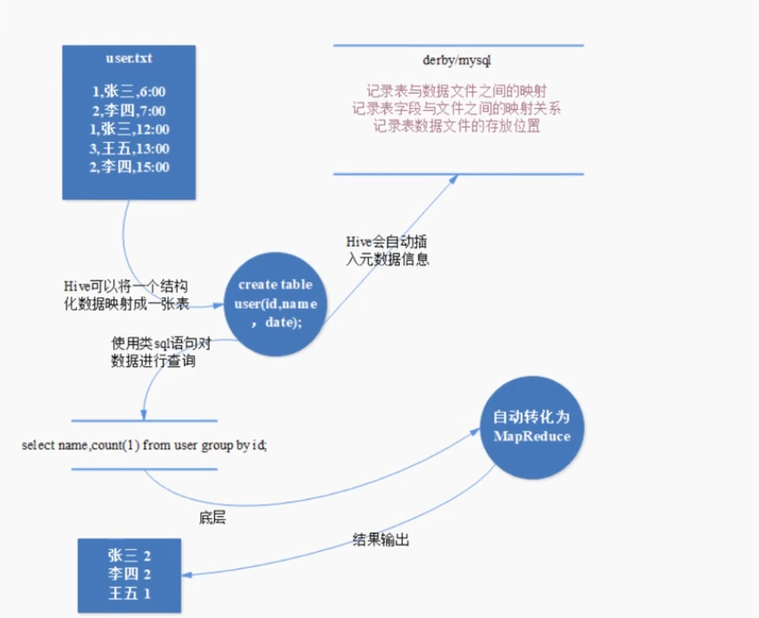
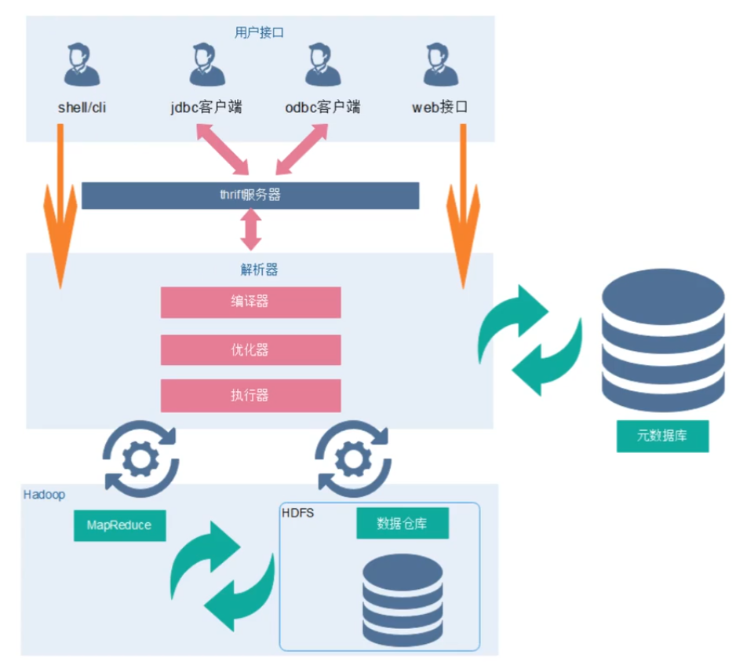
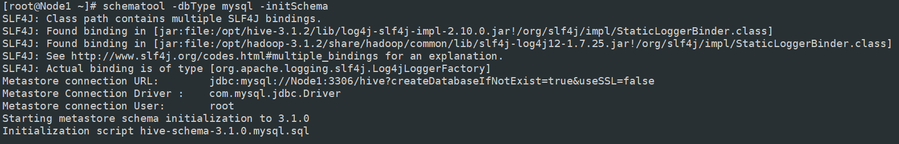
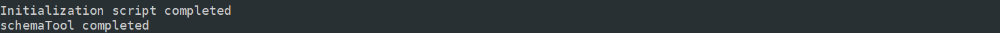
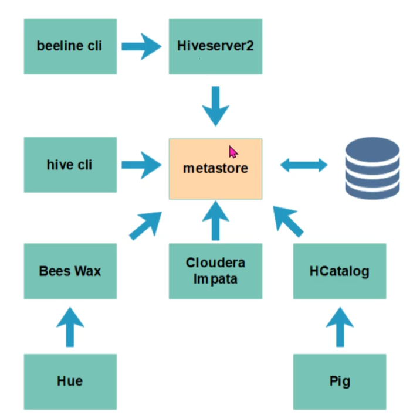
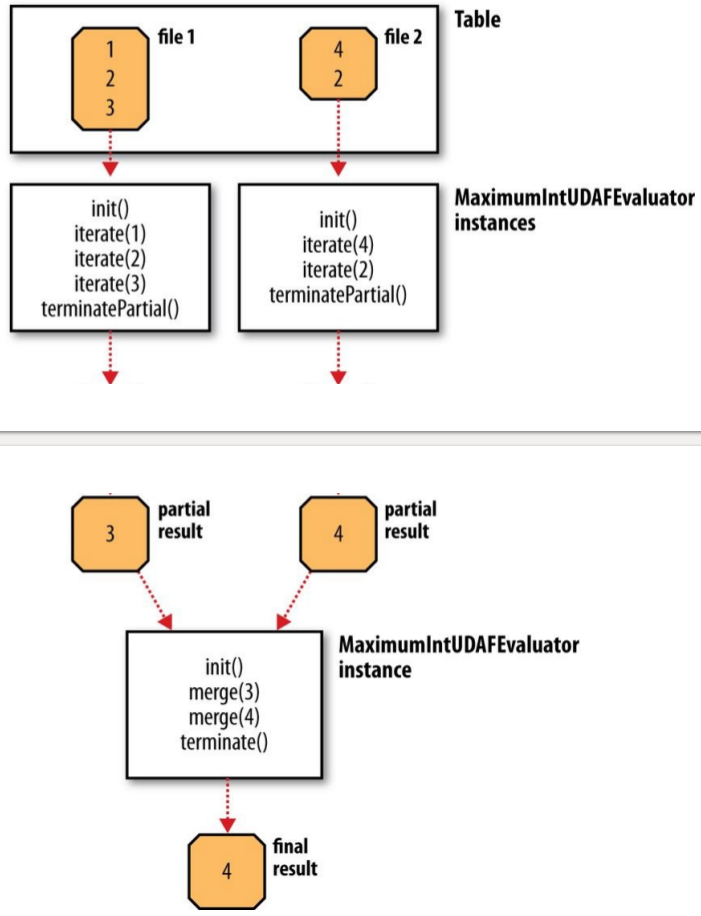
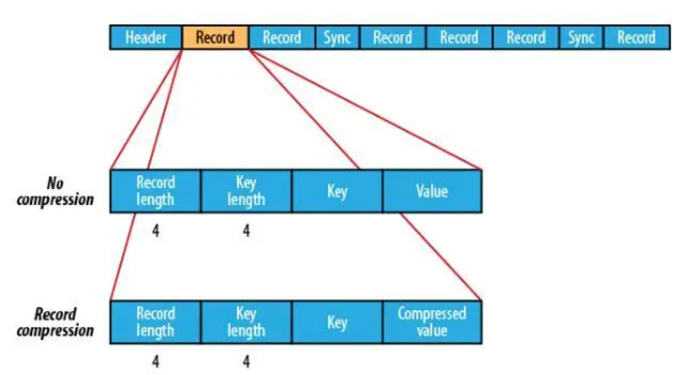
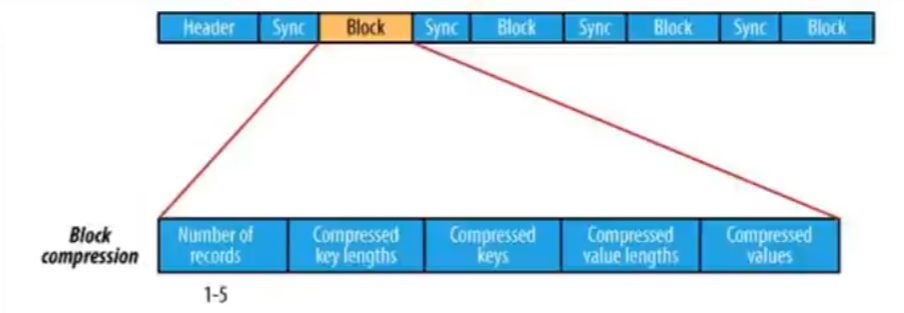

# Hive 3.1.2


Hive是基于 Hadoop 的一个【数据仓库工具】，可以将结构化和半结构化的数据文件映射为一张数据库表，并提供简单的 sql 查询功能


数据库：概念

数据库的作业：存储数据

数据库工具：MySQL、Oracle、……


数据仓库：概念

数据仓库作业：存储大量数据，为决策者做决定提供分析结果

数据仓库：hive，阿里的？？？、……


结构化数据：有行行列列分的很清楚

半结构化数据：xml、json

非结构化数据：视频、图片


## Hive的基本概念

### Hive简介


Hive本质是将SQL转换为MapReduce的任务进行运算，底层由HDFS来提供数据存储

思考：计算文件user.txt中张三出现几次，使用mapreduce怎么写，然后再比照下图的hive的实现过程



- 为什么使用Hive

  - 直接不使用Hadoop

    1）人员学习成本太高

    2）项目要求周期太短

    3）MapReduce实现复杂查询逻辑开发难度太大

  - 为什么要使用Hive

    1）操作接口采用类SQL语法，提供快速开发能力

    2）免去了写MapReduce，减少开发人员学历成本

    3）功能扩展很方便

- Hive的特点

  - 可扩展性

    Hive可以自由的扩展集群的规模，一般情况下不需要重启服务

  - 延展性

    Hive支持自定义函数，用户可以根据自己的需要来实现自己的函数

  - 容错

    即使节点出现错误，SQL仍然可以完成执行

- Hive优缺点

  - 优点

    1）操作接口采用类SQL语法，提供快速开发的能力（简单、容易上手）。

    2）避免了去写MapReduce，减少开发人员的学习成本。
    3）Hive的执行延迟比较高，因此Hive常用于数据分析，对实时性要求不高的场合。

    4）Hive优势在于处理大数据，对于处理小数据没有优势，因为Hive的执行延迟比较高。

    5）Hive支持用户自定义函数，用户可以根据自己的需求来实现自己的函数。

    6）集群可自由拓展并且具有良好的容错性，节点出现问题SQL仍可完成执行。

  - 缺点

    1）Hive的HQL表达能力有限

    ​	（1）迭代式算法无法表达

    ​	（2）数据挖掘方面不擅长

    2）Hive的效率比较低

    ​	（1）Hive自动生成的MapReduce作业，通常情况下不够智能化

    ​	（2）Hive调优比较困难，粒度较粗

- Hive和传统数据库对比

  | 查询语言     | HQL                     | SQL                      |
  | ------------ | ----------------------- | ------------------------ |
  | 数据存储位置 | HDFS                    | Raw Device 或者 Local FS |
  | 数据格式     | 用户定义                | 系统决定                 |
  | 数据更新     | 不支持                  | 支持                     |
  | 索引         | 0.8版本之后加入位图索引 | 复杂的索引               |
  | 执行         | MapReduce               | Executor                 |
  | 执行延迟     | 高                      | 低                       |
  | 可扩展性     | 高                      | 低                       |
  | 数据规模     | 大                      | 小                       |

  数据格式：txt、zip、lzo、tar.gz、orc、rcfile、csv、……

- Hive应用场景

  - 日志分析：大部分互联网公司使用hive进行日志分析，包括百度、淘宝等。
    - 统计网站一个时间段内的pv、uv
    - 多维度数据分析
  - 海量结构化数据离线分析


### Hive架构



#### Client

Hive允许client连接的方式有三个CLI（hive shell）、JDBC / ODBC（Java访问hive）、WEBUI（浏览器访问hive）。JDBC访问时中间件 Thrift 软件框架，跨语言服务开发。DDL DQL DML，整体仿写一套SQL语句。

- client--需要下载安装包
- JDBC/ODBC 也可以连接到Hive
  - 现在主流都在倡导第二种 HiveServer2/beeline
  - 做基于用户名和密码安全的一个效验
- Web Gui
  - hive给我们提供了一套简单的web页面
  - 我们可以通过这套web页面访问hive
  - 做的太简陋了		

#### Metastore

元数据包括表名、表所属的数据库（默认时default）、表的拥有者、列/分区字段、表的类型（是否时外部表）、表的数据所在目录等。

- 一般需要借助于其他的数据载体（数据库）
- 主要用于存放数据库的建表语句等信息
- 推荐使用Mysql数据库存放数据
- 连接数据库需要提供：uri、username、password、driver（并非下面那个Driver，只是一个驱动包）

#### Driver

元数据存储在数据库中，默认存在自带的derby数据库（单用户局限性）中，推荐使用MySQL进行存储。

（1）	解析器（SQL Parser）：将 SQL 字符串转换成抽象语法树AST，这一步一般都用第三方工具库完成，比如ANTLR；对AST进行语法分析，比如表是否存在、字段是否存在、SQL语义是否有误。

（2）	编译器（Physical Plan）：将AST编译生成逻辑执行计划。

（3）	优化器（Query Optimizer）：对逻辑执行计划进行优化。

（4）	执行器（Execution）：把逻辑执行计划转换成可以运行的物理计划。对于Hive来说，就是MR/Spark。

#### 数据处理

Hive的数据存储在HDFS中，计算由MapReduce完成。HDFS和MapReduce是源码级别上的整合，两者结合最佳。解释器、编译器、优化器完成HQL查询语句从词法分析、语法分析、编译、优化以及查询计划的生成。


### Hive的安装

| 节点\功能 | metastore | hiveserver2 | client |
| --------- | --------- | ----------- | ------ |
| node01    | *         | *           | *      |
| node02    |           |             | *      |
| node03    |           |             | *      |

PS：安装前 请确认当前集群已经安装了 Mysql数据库 和 Hadoop的Ha + Yarn

#### 下载地址

- 下载地址

  - [Index of /dist/hive (apache.org)](https://archive.apache.org/dist/hive/)

  - ```
    [root@Node1 ~]# tar -zxvf apache-hive-3.1.2-bin.tar.gz 
    
    [root@Node1 ~]# cd /opt/hive-3.1.2/conf/
    ```

#### 修改配置文件

- 配置hive-env.sh（3.0之前不用配置）

  - [root@Node1 conf]# cp hive-env.sh.template hive-env.sh

  - [root@Node1 conf]# vim hive-env.sh

  - ```sh
    HADOOP_HOME=/opt/hadoop-3.1.2/
    export HIVE_CONF_DIR=/opt/hive-3.1.2/conf
    export HIVE_AUX_JARS_PATH=/opt/hive-3.1.2/lib
    ```

- 创建hive-site.xml

  - [root@Node1 conf]# cp hive-default.xml.template hive-site.xml

  - [root@Node1 conf]# vim hive-site.xml 
  
  - 删除多余的配置文件   6897dd
  
  - ```xml
    <!-- 数据库相关配置 -->
    <property>
        <name>javax.jdo.option.ConnectionURL</name>
        <value>jdbc:mysql://Node1:3306/hive?createDatabaseIfNotExist=true
            &amp;useSSL=false</value>
    </property>
    
    <property>
        <name>javax.jdo.option.ConnectionDriverName</name>
        <value>com.mysql.jdbc.Driver</value>
    </property>
    
    <property>
        <name>javax.jdo.option.ConnectionUserName</name>
        <value>root</value>
    </property>
    
    <property>
        <name>javax.jdo.option.ConnectionPassword</name>
        <value>123456</value>
    </property>
    
    <property>
        <name>datanucleus.schema.autoCreateAll</name>
        <value>true</value>
    </property>
    
    <property>
        <name>hive.metastore.schema.verification</name>
        <value>false</value>
    </property>
    
    <!-- 美化打印数据 -->
    <property>
        <name>hive.cli.print.header</name>
        <value>true</value>
    </property>
    
    <property>
        <name>hive.cli.print.current.db</name>
        <value>true</value>
    </property>
    
    <!-- hive server -->
    <property>
        <name>hive.server2.webui.host</name>
        <value>Node1</value>
    </property>
    
    <property>
        <name>hive.server2.webui.port</name>
        <value>10002</value>
    </property>
    
    <!-- 数据存储位置 -->
    <property>
        <name>hive.metastore.warehouse.dir</name>
        <value>/hive/warehouse</value>
    </property>
    ```
  
- 修改core-site.xml

  - [root@Node1 conf]# vim /opt/hadoop-3.1.2/etc/hadoop/core-site.xml 

  - 后面添加配置信息

  - ```xml
    <!--该参数表示可以通过httpfs接口hdfs的ip地址限制-->
    <property>
        <name>hadoop.proxyuser.root.hosts</name>
        <value>*</value>
    </property>
        
    <!--通过httpfs接口访问的用户获得的群组身份-->
    <property>
        <name>hadoop.proxyuser.root.groups</name>
        <value>*</value>
    </property>
    ```


#### 配置日志组件

- 创建文件目录

  - [root@Node1 conf]# mkdir -p /opt/hive-3.1.2/logs

  - [root@Node1 conf]# cp hive-log4j2.properties.template hive-log4j2.properties

  - [root@Node1 conf]# vim hive-log4j2.properties

  - ```properties
    property.hive.log.dir = /opt/hive-3.1.2/logs
    ```

#### 添加驱动包

- Mysql驱动添加到hive的lib目录下

- [root@Node1 ~]# cp ~/mysql-connector-java-5.1.49.jar /opt/hive-3.1.2/lib/

- Guava包

  - 首先要删除Hadoop中的guava-*.jar包

  - ```
    [root@Node1 ~]# rm -rf /opt/hadoop-3.1.2/share/hadoop/common/lib/guava-*.jar
    [root@Node1 ~]# rm -rf /opt/hadoop-3.1.2/share/hadoop/hdfs/lib/guava-*.jar
    ```

  - 将Hive的Guava靠背给hadoop

  - ```
    [root@Node1 ~]# cp /opt/hive-3.1.2/lib/guava-*.jar /opt/hadoop-3.1.2/share/hadoop/common/lib/
    [root@Node1 ~]# cp /opt/hive-3.1.2/lib/guava-*.jar /opt/hadoop-3.1.2/share/hadoop/hdfs/lib/
    ```

#### 配置环境变量

- vim /etc/profile

  - ```
    export HIVE_HOME=/opt/hive-3.1.2
    export PATH=$HIVE_HOME/bin:$PATH
    ```

- source /etc/profile

#### 拷贝到其他节点

- hive文件夹

  - ```
    [root@Node1 ~]# scp -r /opt/hive-3.1.2/ node2:/opt
    [root@Node1 ~]# scp -r /opt/hive-3.1.2/ node3:/opt
    ```

- 环境变量

  - ```
    [root@Node1 ~]# scp /etc/profile node2:/etc/profile
    [root@Node1 ~]# scp /etc/profile node3:/etc/profile
    ```

  - 【123】source /etc/profile

- core-site.xml

  - ```
    [root@Node1 ~]# scp /opt/hadoop-3.1.2/etc/hadoop/core-site.xml node2:/opt/hadoop-3.1.2/etc/hadoop/
    [root@Node1 ~]# scp /opt/hadoop-3.1.2/etc/hadoop/core-site.xml node3:/opt/hadoop-3.1.2/etc/hadoop/
    ```

- jar包

  - ```
    [root@Node2 ~]# rm -rf /opt/hadoop-3.1.2/share/hadoop/common/lib/guava-*.jar 
    [root@Node2 ~]# rm -rf /opt/hadoop-3.1.2/share/hadoop/hdfs/lib/guava-*.jar
    [root@Node3 ~]# rm -rf /opt/hadoop-3.1.2/share/hadoop/common/lib/guava-*.jar 
    [root@Node3 ~]# rm -rf /opt/hadoop-3.1.2/share/hadoop/hdfs/lib/guava-*.jar
    
    [root@Node2 ~]# cp /opt/hive-3.1.2/lib/guava-*.jar /opt/hadoop-3.1.2/share/hadoop/common/lib/
    [root@Node2 ~]# cp /opt/hive-3.1.2/lib/guava-*.jar /opt/hadoop-3.1.2/share/hadoop/hdfs/lib/
    
    [root@Node3 ~]# cp /opt/hive-3.1.2/lib/guava-*.jar /opt/hadoop-3.1.2/share/hadoop/common/lib/
    [root@Node3 ~]# cp /opt/hive-3.1.2/lib/guava-*.jar /opt/hadoop-3.1.2/share/hadoop/hdfs/lib/
    ```

#### 客户端配置文件

- 选取Node3为客户端节点

  - [23] vim /opt/hive-3.1.2/conf/hive-site.xml

  - ```xml
    <!-- 美化打印数据 -->
    <property>
      <name>hive.cli.print.header</name>
      <value>true</value>
    </property>
    
    <property>
      <name>hive.cli.print.current.db</name>
      <value>true</value>
    </property>
    
    <!-- hive server -->
    <property>
      <name>hive.server2.webui.host</name>
      <value>Node1</value>
    </property>
    
    <property>
      <name>hive.server2.webui.port</name>
      <value>10002</value>
    </property>
    
    <!-- 数据存储位置 -->
    <property>
      <name>hive.metastore.warehouse.dir</name>
      <value>/hive/warehouse</value>
    </property>
    
    <!--指定hive.metastore.uris的port，为了启动metastore服务的时候不用指定端口-->
    <!--hive --service metastore -p 9083 & | hive --service metastore-->
    <property>
        <name>hive.metastore.uris</name>
        <value>thrift://node1:9083</value>
    </property>
    ```

#### 启动集群

- 启动Zookeeper
  - 【123】zkServer.sh start
- 启动Hdfs + Yarn
  - [root@Node1 ~]# start-all.sh
- 初始化数据库
  - [root@Node1 ~]# schematool -dbType mysql -initSchema
  - 
  - 
- 启动Hive
  - [root@Node1 ~]# hive --service metastore
  - [root@Node1 ~]# nohup hive --service metastore > /dev/null 2>&1 &
  - [root@Node3 ~]# hive
- 启动HiveServer2
  - [root@Node1 ~]# hiveserver2
  - [root@Node1 ~]# nohup hiveserver2 > /dev/null 2>&1 &
  - [root@Node1 ~]# beeline -u jdbc:hive2://Node1:10000 -n root


### Hive的三种交互方式

1）第一种交互方式

shell交互Hive，用命令hive启动一个hive的shell命令行，在命令行中输入sql或者命令来和Hive交互

```
服务端启动metastore服务：nohup hive --service metastore > /dev/null 2>&1 &
进入命令：hive
退出命令行：quit;
```

2）第二种交互方式

Hive启动为一个服务器，对外提供服务，其他机器可以通过客户端通过协议连接服务器，来完成访问操作，这是生产环境用法最多的

```
hadoop fs -chmod -R 777 /bdp

服务端启动hiveserver2服务：nohup hiveserver2 > /dev/null 2>&1 &

需要稍等一下，启动服务需要时间;

进入命令：1)先执行beeline, 再执行 '!connect jdbc:hive2://node1:10000'
		2)或者直接执行 beeline -u jdbc:hive2://node1:10000 -n root
		
退出命令行：!exit
```

3）第三种交互方式

- 使用  -e  参数来直接执行hql的语句

  ```shell
  bin/hive -e 'show databases;'
  ```

- 使用  -f  参数通过指定文本文件来执行hql的语句

  ```shell
  vim hive.sql
  ```

  ```sql
  use myhive;
  select * from test;
  ```

  保存退出

  ```shell
  hive -f hive.sql
  ```

  特点：执行完sql后，回到Linux命令行

4）在hive cli和beeline cli的区别



- metastore服务实际上就是一种thrift服务，通过它我们可以获取到hive元数据，并且通过thrift获取元数据的方式，屏蔽了 数据库访问需要驱动，url，用户名，密码等等细节。

  HiveServer2（HS2）是一个服务端接口，使远程客户端可以执行对Hive的查询并返回结果。一般来讲，我们认为HiveServer2是用来提交查询的，也就是用来访问数据的。而MetaStore才是用来访问元数据的。

- beeline  cli 优化了命令行界面


### Hive元数据

Hive元数据库中一些重要的表结构及用途，方便Impala、SparkSQL、Hive等组件访问元数据库的理解。

1、存储Hive版本的元数据表（VERSION）

该表比较简单，但很重要。

| VER_ID | SCHEMA_VERSION | VERSION_COMMENT    |
| ------ | -------------- | ------------------ |
| ID主键 | Hive版本       | 版本说明           |
| 1      | 1.1.0          | Set  by  MetaStore |

如果该表出现问题，根本进入不了Hive-Cli。比如该表不存在，当启动Hive-Cli时候，就会报错"Table  'hive.version'  doesn't  exist"。


2、Hive数据库相关的元数据表（DBS、DATABASE_PARAMS）

DBS：该表存储Hive中所有数据库的基本信息，字段如下：

| 表字段          | 说明               | 示例数据                                |
| --------------- | ------------------ | --------------------------------------- |
| DB_ID           | 数据库ID           | 1                                       |
| DESC            | 数据库描述         | Default Hive database                   |
| DB_LOCATION_URI | 数据库HDFS路径     | hdfs://193.168.1.75:9000/test-warehouse |
| NAME            | 数据库名           | default                                 |
| OWNER_NAME      | 数据库所有者用户名 | public                                  |
| OWNER_TYPE      | 所有者角色         | ROLE                                    |


DATABASE_PARAMS：该表存储数据库的相关参数，在CREATE  DATABASE时候用WITH  DBPROPERTIES(property_name=property_value , …)指定的参数。

| 表字段      | 说明     | 示例数据  |
| ----------- | -------- | --------- |
| DB_ID       | 数据库ID | 1         |
| PARAM_KEY   | 参数名   | createdby |
| PARAM_VALUE | 参数值   | root      |

DBS和DATABASE_PARAMS这两张表通过DB_ID字段关联。


3、Hive表和视图相关的元数据表

主要有TBLS、TABLE_PARAMS、TBL_PRIVS，这三张表通过TBL_ID关联。

TBLS：该表中存储Hive表，视图，索引表的基本信息

| 表字段             | 说明              | 示例数据                   |
| ------------------ | ----------------- | -------------------------- |
| TBL_ID             | 表ID              | 21                         |
| CREATE_TIME        | 创建时间          | 144767504                  |
| DB_ID              | 数据库ID          | 1                          |
| LAST_ACCESS_TIME   | 上次访问时间      | 144767504                  |
| OWNER              | 所有者            | root                       |
| RETENTION          | 保留字段          | 0                          |
| SD_ID              | 序列化配置信息    | 41，对应SDS表中的SD_ID     |
| TBL_NAME           | 表名              | ex_detail_ufdr_30streaming |
| TBL_TYPE           | 表类型            | EXTERNAL_TABLE             |
| VIEW_EXPANDED_TEXT | 视图的详细HQL语句 |                            |
| VIEW_ORIGINAL_TEXT | 视图的原始HQL语句 |                            |


TABLE_PARAMS：该表存储表/视图的属性信息

| 表字段      | 说明   | 示例数据                     |
| ----------- | ------ | ---------------------------- |
| TBL_ID      | 表ID   | 1                            |
| PARAM_KEY   | 属性名 | totalSize，numRows，EXTERNAL |
| PARAM_VALUE | 属性值 | 970107336、21231028、TRUE    |


TBL_PRIVS：该表存储表/视图的授权信息

| 表字段         | 说明           | 示例数据               |
| -------------- | -------------- | ---------------------- |
| TBL_GRANT_ID   | 授权ID         | 1                      |
| CREATE_TIME    | 授权时间       | 1436320455             |
| GRANT_OPTION   |                | 0                      |
| GRANTOR        | 授权执行用户   | root                   |
| GRANTOR_TYPE   | 授权者类型     | USER                   |
| PRINCIPAL_NAME | 被授权用户     | username               |
| PRINCIPAL_TYPE | 被授权用户类型 | USER                   |
| TBL_PRIV       | 权限           | Select、Alter          |
| TBL_ID         | 表ID           | 21，对应TBLS表的TBL_ID |


4、Hive文件存储信息相关的元数据表

主要涉及SDS、SD_PARAMS、SERDES、SERDE_PARAMS，由于HDFS支持的文件格式很多，而建Hive表时候也可以指定各种文件格式，Hive在将HQL解析成MapReduce时候，需要知道去哪里，使用哪种格式去读写HDFS文件，而这些信息就保存在这几张表中。

SDS：

该表保存文件存储的基本信息，如INPUT_FORMAT、OUTPUT_FORMAT、是否压缩等。TBLS表中的SD_ID与该表关联，可以获取Hive表的存储信息。

| 表字段                    | 说明             | 示例数据                                                     |
| ------------------------- | ---------------- | ------------------------------------------------------------ |
| SD_ID                     | 存储信息ID       | 41                                                           |
| CD_ID                     | 字段信息ID       | 21，对应CDS表                                                |
| INPUT_FORMAT              | 文件输入格式     | org.apache.hadoop.mapred.TextInputFormat                     |
| IS_COMPRESSED             | 是否压缩         | 0                                                            |
| IS_STOREDASSUBDIRECTORIES | 是否以子目录存储 | 0                                                            |
| LOCATION                  | HDFS路径         | hdfs://193.168.1.75:9000/detail<br>_ufdr_streaming_test      |
| NUM_BUCKETS               | 分桶数量         | 0                                                            |
| OUTPUT_FORMAT             | 文件输出格式     | org.apache.hadoop.hive.ql.io.<br>HivelgnoreKeyTextOutputFormat |
| SERDE_ID                  | 序列化类ID       | 41，对应SERDES表                                             |


SD_PARAMS:该表存储Hive存储的属性信息，在创建表时候使用STORED BY ‘storage.handler.class.name’[WITH SERDEPROPERTIES(…)指定]

| 表字段      | 说明       | 示例数据 |
| ----------- | ---------- | -------- |
| SD_ID       | 存储配置ID | 41       |
| PARAM_KEY   | 存储属性名 |          |
| PARAM_VALUE | 存储属性值 |          |


SERDES：该表存储序列化使用的类信息

| 表字段   | 说明           | 示例数据                                           |
| -------- | -------------- | -------------------------------------------------- |
| SERDE_ID | 序列化类配置ID | 41                                                 |
| NAME     | 序列化类别名   | NULL                                               |
| SLIB     | 序列化类       | org.apache.hadoop.hive.serde2.lazy.LazySimpleSerDe |


SERDE_PARAMS：该表存储序列化的一些属性、格式信息，比如：行、列分隔符

| 表字段      | 说明           | 示例数据    |
| ----------- | -------------- | ----------- |
| SERDE_ID    | 序列化类配置ID | 41          |
| PARAM_KEY   | 属性名         | field.delim |
| PARAM_VALUE | 属性值         | \|          |


5、Hive表字段相关的元数据表

主要涉及COLUMNS_V2

COLUMNS_V2：该表存储表对应的字段信息

| 表字段      | 说明       | 示例数据          |
| ----------- | ---------- | ----------------- |
| CD_ID       | 字段信息ID | 21                |
| COMMENT     | 字段注释   | NULL              |
| COLUMN_NAME | 字段名     | air_port_duration |
| TYPE_NAME   | 字段类型   | bigint            |
| INTEGER_IDX | 字段顺序   | 119               |


6、Hive表分分区相关的元数据表

主要涉及PARTITIONS、PARTITION_KEYS、PARTITION_KEY_VALS、PARTITION_PARAMS

PARTITIONS：该表存储表分区的基本信息

| 表字段           | 说明             | 示例数据              |
| ---------------- | ---------------- | --------------------- |
| PART_ID          | 分区ID           | 21                    |
| CREATE_TIME      | 分区创建时间     | 1450861405            |
| LAST_ACCESS_TIME | 最后一次访问时间 | 0                     |
| PART_NAME        | 分区名           | hour=15/last_msisdn=0 |
| SD_ID            | 分区存储ID       | 43                    |
| TBL_ID           | 表ID             | 22                    |
| LINK_TARGET_ID   |                  | NULL                  |


PARTITION_KEYS：该表存储分区的字段信息

| 表字段       | 说明         | 示例数据 |
| ------------ | ------------ | -------- |
| TBL_ID       | 表ID         | 22       |
| PKEY_COMMENT | 分区字段说明 | NULL     |
| PKEY_NAME    | 分区字段名   | hour     |
| PKEY_TYPE    | 分区字段类型 | int      |
| INTEGER_IDX  | 分区字段顺序 | 0        |


PARTITION_KEY_VALS：该表存储分区字段值

| 表字段       | 说明           | 示例数据 |
| ------------ | -------------- | -------- |
| PART_ID      | 分区ID         | 21       |
| PART_KEY_VAL | 分区字段值     | 0        |
| INTEGER_IDX  | 分区字段值顺序 | 1        |


PARTITION_PARAMS：该表存储分区的属性信息

| 表字段      | 说明       | 示例数据          |
| ----------- | ---------- | ----------------- |
| PART_ID     | 分区ID     | 21                |
| PARAM_KEY   | 分区属性名 | numFiles，numRows |
| PARAM_VALUE | 分区属性值 | 1，502195         |


7、其他不常用的元数据表

DB_PRIVS：数据库权限信息表。通过GRANT语句对数据库授权后，将会在这里存储。

IDXS：索引表，存储Hive索引相关的元数据

INDEX_PARAMS：索引相关的属性信息

TBL_COL_STATS：表字段的统计信息。使用ANALYZE语句对表字段分析后记录在这里

TBL_COL_PRIVS：表字段的授权信息

PART_PRIVS：分区的授权信息

PART_COL_PRIVS：分区字段的权限信息

PART_COL_STATS：分区字段的统计信息

FUNCS：用户注册的函数信息

FUNC_RU：用户注册函数的资源信息


## Hive的基本操作

```
CREATE [TEMPORARY] [EXTERNAL] TABLE [IF NOT EXISTS] [db_name.]table_name
	LIKE existing_table_or_view_name
	[LOCATION hdfs_path];
	
data_type
	: primitive_type
	| array_type
	| map_type
	| struct_type
	| union_type
	
primitive_type
	: TINYINT
	| SMALLINT
	| INT
	| BIGINT
	| BOOLEAN
	| FLOAT
	| DOUBLE
	| DOUBLE PRECISION
	| STRING
	| BINARY
	| TIMESTAMP
	| DECIMAL
	| DECIMAL(precision, scale)
	| DATE
	| VARCHAR
	| CHAR
	
array_type
	: ARRAY < data_type >
	
map_type
	: MAP < primitive_type, data_type >
	
struct_type
	: STRUCT < col_name : data_type [COMMENT col_comment], ... >
	
union_type
	: UNIONTYPE < data_type, data_type, ... >
	
```


### Hive库操作

#### 创建数据库

1）创建一个数据库，数据库在HDFS上的默认存储路径是/hive/warehouse/*.db。

```sql
create database shop;
```

2）避免要创建的数据库已经存在错误，增加if not exists判断。（标准写法）

```sql
create database if not exists shop;
```

#### 创建库指定位置

```sql
create database if not exists school location '/school.db';
```

#### 修改数据库

用户可以使用ALTER DATABBASE命令为某个数据库的DBPROPERTIES设置键-值对属性值，来描述这个数据库的属性信息。数据库的其他元数据信息都是不可更改的，包括数据库名和数据库所在的目录位置。

```sql
alter database school set dbproperties('createtime'='20221019')
```

#### 数据库详细信息

1）显示数据库（show）

```sql
show databases;
```

2）可以通过like进行过滤

```sql
show databases like 's*';
```

3）查看详情（desc）

```sql
desc database school;
```

4）切换数据库（use）

```sql
use school;
```

#### 删除数据库

1）最简写法

```sql
drop database school;
```

2）如果删除的数据库不存在，最好使用if exists判断数据库是否存在。否则数据库不存在会报错：

FAILED: SemanticException

[Error 10072]：Database does not exist: db_hive

```sql
drop database if exists school;
```

3）如果数据库不为空，使用cascade命令进行强制删除。否则报错信息如下：

FAILED: Execution Error, return code 1 from org.apache.hadoop.hive.ql.exec.DDLTask. InvalidOperationException(message:Database school is not empty. One or more tables exist.)

```sql
drop database if exists school cascade;
```


### Hive数据类型

#### 基础数据类型

| 类型                     | Java数据类型 | 描述                                                         |
| ------------------------ | ------------ | ------------------------------------------------------------ |
| TINYINT                  | byte         | 8位有符号整型。取值范围：-128~127。                          |
| SMALLINT                 | short        | 16位有符号整型。取值范围：-327468~32767。                    |
| INT                      | int          | 32位有符号整型。取值范围：-2^31 ~ 2^31 - 1。                 |
| BIGINT                   | long         | 64位有符号整型。取值范围：-2^63 + 1 ~ 2^63 - 1。             |
| BINARY                   |              | 二进制数据类型，目前长度限制为8MB。                          |
| FLOAT                    | float        | 32位二进制浮点型。                                           |
| DOUBLE                   | double       | 64位二进制浮点型。                                           |
| DECIMAL(precision,scale) |              | 10进制精确数字类型。**precision**：表示最多可以表示多少位的数字。取值范围：`1 <= precision <= 38`。**scale**：表示小数部分的位数。取值范围：`0 <= scale <= 38`。如果不指定以上两个参数，则默认为`decimal(10,0)` |
| VARCHAR(n)               |              | 变长字符类型，n为长度。取值范围：1~65535。                   |
| CHAR(n)                  |              | 固定长度字符类型，n为长度。最大取值255。长度不足则会填充空格，但空格不参与比较。 |
| STRING                   | string       | 字符串类型，目前长度限制为8MB。                              |
| DATE                     |              | 日期类型，格式为`yyyy-mm-dd`。取值范围：0000-01-01~9999-12-31。 |
| DATETIME                 |              | 日期时间类型。取值范围：0000-01-01 00:00:00.000~9999-12-31 23.59:59.999，精确到毫秒。 |
| TIMESTAMP                |              | 与时区无关的时间戳类型。取值范围：0000-01-01<br>00:00:00.000000000~9999-12-31 23.59:59.999999999，精确到纳秒。**说明**对于部分时区相关的函数，例如`cast(<a timestamp> as string)`，要求TIMESTAMP按照与当前时区相符的方式来展现。 |
| BOOLEAN                  | boolean      | BOOLEAN类型。取值：True、False。                             |

#### 复杂数据类型

| 类型   | 定义方法                                                     | 构造方法                                                     |
| ------ | ------------------------------------------------------------ | ------------------------------------------------------------ |
| ARRAY  | `array<int>，array<struct<a:int,b:string>>`                  | `array(1,2,3), array(array(1,2),array(3,4))`                 |
| MAP    | `map<string,string>, map<smallint,array<string>>`            | `map("k1","v1","k2","v2"), map(1S,array('a','b'),2S,array('x','y))` |
| STRUCT | `struct<x:int,y:int>, struct<field1:bigint, field2:array<int>, field3:map<int,int>>` | `named_struct('x',1,'y',2), named_struct('field1',100L, 'field2','array(1,2)', 'field3',map(1,100,2,200))` |

Hive有三种复杂数据类型ARRAY、MAP和STRUCT。ARRAY和MAP与Java中的Array和Map类似，而STRUCT与C语言中的Struct类似，它封装了一个命名字段集合，复杂数据类型允许任意层次的嵌套。


### Hive表操作

#### 创建表

```hive
CREATE [EXTERNAL] TABLE [IF NOT EXISTS] table_name
[(col_name data_type [COMMENT col_comment], ...)]
[COMMENT table_comment]
[PARTITIONED BY (col_name data_type [COMMENT col_comment]，...)]
[cLUSTERED BY (col_name,col_name, ...)
[SORTED BY (col_name [ASC|DESC]，...)] INTO num_buckets BUCKETS]
[ROW FORMAT row_format]
[STORED AS file_format]
[LOCATION hdfs_path]

字段解释说明:
- CREATE TABLE
	创建一个指定名字的表。如果相同名字的表已经存在，则抛出异常;用户可以用IF NOT EXISTS选项来忽略这个异常。
	
- EXTERNAL
	关键字可以让用户创建一个外部表，在建表的同时指定一个指向实际数据的路径（LOCATION)
	创建内部表时，会将数据移动到数据仓库指向的路径（默认位置）;
	创建外部表时，仅记录数据所在的路径，不对数据的位置做任何改变。
	在删除表的时候，内部表的元数据和数据会被一起删除，而外部表只删除元数据，不删除数据。
	
- COMMENT
	为表和列添加注释。
	
- PARTITIONED BY
	创建分区表
	
- CLUSTERED BY
	创建分桶表
	
- SORTED BY
	不常用
	
- ROW FORMAT
	DELIMITED [FIELDS TERMINATED BY char] [COLLECTION ITEMS TERMINATED BY char] [MAP KEYS TERMINATED BY char] [LINES TERMINATED BY char] | SERDE serde_name [WITH SERDEPROPERTIES(property_name=property_value，property.name=property_value，...)]
	用户在建表的时候可以自定义SerDe或者使用自带的SerDe。
	如果没有指定ROW FORMAT 或者 ROW FORMAT DELIMITED，将会使用自带的SerDe。
	在建表的时候，用户还需要为表指定列，用户在指定表的列的同时也会指定自定义的SerDe，Hive通过SerDe确定表的具体的列的数据。
	SerDe是Serialize/Deserilize的简称，目的是用于序列化和反序列化。
	
- STORED AS指定存储文件类型
	常用的存储文件类型：SEQUENCEFILE(二进制序列文件)、TEXTFILE(文本)、RCFILE(列式存储格式文件)
	如果文件数据是纯文本，可以使用STORED AS TEXTFILE。
	如果数据需要压缩，使用STORED As SEQUENCEFILE。
	
- LOCATION 
	指定表在HDFS上的存储位置。
	
- LIKE
	允许用户复制现有的表结构，但是不复制数据。
```

- 根据数据创建表结构

- 案例1：简单用户信息

  - ```
    1,admin,123456,男,18
    2,zhangsan,abc123,男,23
    3,lisi,654321,女,16
    ```

  - ```sql
    create table T_user(
    id int,
    uname string,
    pwd string,
    gender string,
    age int
    )
    row format delimited fields terminated by ','
    lines terminated by '\n';
    
    --载入数据代码
    load data inpath '/bdp/raw/user.txt' into table t_user;
    ```

- 案例2：复杂人员信息

  - ```
    songsong,bingbing_lili,xiao song:18_xiaoxiao song:19,hui long guan_beijing
    yangyang,caicai_susu,xiao yang:18_xiaoxiao yang:19,chao yang_beijing
    ```

  - ```hive
    create table IF NOT EXISTS t_person(
    name string,
    friends array<string>,
    children map<string,int>,
    address struct<street:string,city:string>
    )
    collection items terminated by '_'
    map keys terminated by ':'
    lines terminated by '\n';
    
    --载入数据代码
    load data inpath '/bdp/raw/person.txt' into table t_person ;
    ```

#### 显示表

```sql
show tables;
show tables like 'u';
desc t_person;
desc formatted t_person;
```

#### 重命名

内部表（同时修改文件目录） 外部表 （因为目录是共享的，所以不会修改目录名称）

- 基本语法

```sql
alter table old_table_name rename to new_table_name;
```

- 把t_old改成t_new

```sql
alter table t_old rename to t_new
```

#### 修改列

- 查询表结构

```sql
desc test_new;
```

- 添加列

```sql
alter table test_new add columns(education string);
```

- 更新列

```sql
alter table test_new change education education_new string;
```

#### 删除表

```sql
drop table test_new;
```


### Hive内外部表

#### hive内部表

- 当创建好表的时候，HDFS会在当前表所属的库中创建一个文件夹
- 当设置表路径的时候，如果直接指向一个已有的路径,可以直接去使用文件夹中的数据
- 当load数据的时候，就会将数据文件存放到表对应的文件夹中
- 而且数据一旦被load，就不能被修改
- 我们查询数据也是查询文件中的文件,这些数据最终都会存放到HDFS
- 当我们删除表的时候，表对应的文件夹会被删除，同时数据也会被删除（**重点**特征）

#### hive外部表

- 外部表说明

  - 外部表因为是指定其他的hdfs路径的数据加载到表中来，所以hive会认为自己不完全独占这份数据
  - 删除hive表的时候，数据仍然保存在hdfs中，不会删除。

- 操作案例：

- 分别创建dept，emp，salgrade，并加载数据。

  - 创建数据文件存放的目录

  - ```shell
    hdfs dfs -mkdir -p /bdp/dept
    hdfs dfs -mkdir -p /bdp/emp
    hdfs dfs -mkdir -p /bdp/salgrade
    ```

  - 创建dept表

  - ```hive
    CREATE EXTERNAL TABLE IF NOT EXISTS dept (
        DEPTNO int,
    	DNAME varchar(255),
        LOC varchar(255)
    ) 
    row format delimited fields terminated by ','
    location '/bdp/dept';
    
    10,ACCOUNTING,NEW YORK
    20,RESEARCH,DALLAS
    30,SALES,CHICAGO
    40,OPERATIONS,BOSTON
    ```
    
  - 创建emp表
  
  - ```sql
    CREATE EXTERNAL TABLE IF NOT EXISTS emp (
    	EMPNO int,
    	ENAME varchar(255),
        JOB varchar(255),
        MGR int,
    	HIREDATE date,
        SAL decimal(10,0),
        COMM decima1(10,0),
        DEPTNO int
    ) 
    row format delimited fields terminated by ','
    location '/bdp/emp';
    
    7369,SMITH,CLERK,7902,1980-12-17,800,null,20
    7499,ALLEN,SALESMAN,7698,1981-02-20,1600,300,30
    7521,WARD,SALESMAN,7698,1981-02-22,1250,500,30
    7566,JONES,MANAGER,7839,1981-04-02,2975,null,20
    7654,MARTIN,SALESMAN,7698,1981-09-28,1250,1400,30
    7698,BLAKE,MANAGER,7839,1981-05-01,2850,null,30
    7782,CLARK,MANAGER,7839,1981-06-09,2450,null,10
    7788,SCOTT,ANALYST,7566,1987-07-13,3000,null,20
    7839,KING,PRESIDENT,null,1981-11-17,5000,null,10
    7844,TURNER,SALESMAN,7698,1981-09-08,1500,0,30
    7876,ADAMS,CLERK,7788,1987-07-13,1100,null,20
    7900,JAMES,CLERK,7698,1981-12-03,950,null,30
    7902,FORD,ANALYST,7566,1981-12-03,3000,null,20
    7934,MILLER,CLERK,7782,1982-01-23,1300,null,10
    ```
    
  - 创建salgrade表
  
  - ```sql
    CREATE EXTERNAL TABLE IF NOT EXISTS salgrade (
    	GRADE int,
    	LOSAL int,
    	HISAL int
    ) row format delimited fields terminated by ','
    location '/bdp/salgrade';
    1,700,1200
    2,1201,1400
    3,1401,2888
    4,2001,3000
    5,3001,9999
    ```


### Hive载入数据

- 基本语法

  - ```sql
    load data [local] inpath 'datapath' [overwrite] into table student [partition(partcol1-val1 ,…)];
    
    --load data
    	加载数据
    --[local]
    	本地，不加Local就是从HDFS，如果是HDFS，将会移动原来的数据到表的目录下
    --inpath
    	数据的路径
    --'datapath'
    	具体的路径，要参考本地还是HDFS
    --[overwrite]
    	覆盖
    --into table
    	加入到表
    --student
    	表的名字
    --[partition (partcol1=val1 ,…)]
    	分区
    ```

- 加载Linux本地数据

```hive
load data local inpath '/root/user.txt' into table t_user;
```

- 加载HDFS数据

```hive
load data inpath '/bdp/user.txt' into table t_user;
```

- 加载并覆盖已有数据

```hive
load data inpath '/bdp/user.txt' overwrite into table t_user;
```

- 通过查询插入数据

  - 创建表

  - ```hive
    create table t_user1(
        uname string
    )
    row format delimited fields terminated by ','
    lines terminated by '\n';
    
    create table t_user2(
    	pwd string
    )
    row format delimited fields terminated by ','
    lines terminated by '\n';
    ```

  - 插入查询结果

  - ```hive
    --将查询结果插入一张表
    insert overwrite table t_user1 select uname from t_user;
    insert overwrite table t_user2 select pwd from t_user;
    
    --将查询结果一次性存放到多张表
    from t_user
    insert overwrite table t_user1 select uname
    insert overwrite table t_user2 select pwd
    ;
    
    --插入语句
    insert into table t_user1 values (),(),().....;
    ```


### Hive导出数据

- 将表中的数据备份

  - 将查询结果存放到本地

  ```hive
  //创建存放数据的目录
  mkdir -p /root/bdp
  
  //导出查询结果的数据(导出到Node1上)
  insert overwrite local directory '/root/bdp/person_data' select * from t_person;
  ```

  - 按照指定的方式将数据输出到本地

  ```hive
  //创建存放数据的目录
  mkdir -p /root/bdp
  
  //导出查询结果的数据
  insert overwrite local directory '/root/bdp/person'
  ROW FORMAT DELIMITED fields terminated by ','
  collection items terminated by '-'
  map keys terminated by ':'
  lines terminated by '\n'
  select * from t_person;
  ```

  - 将查询结果输出到HDFS

  ```hive
  //创建存放数据的目录
  hdfs dfs -mkdir -p /bdp/copy
  
  //导出查询结果的数据
  insert overwrite directory '/bdp/copy/user'
  ROW FORMAT DELIMITED FIELDS TERMINATED BY ','
  select * from t_user;
  ```

- 直接使用HDFS命令保存表对应的文件夹

```shell
//创建存放数据的目录
hdfs dfs -mkdir -p /bdp/person

//使用HDFS命令拷贝文件到其他目录
hdfs dfs -cp /hive/warehouse/t_person/*  /bdp/person
```

- 将表结构和数据同时备份

  - 将数据导出到HDFS

  ```hive
  //创建存放数据的目录
  hdfs dfs -mkdir -p /bdp/copy
  
  //导出查询结果的数据
  export table t_person to '/bdp/copy';
  ```

  - 删除表结构

  ```hive
  drop table t_person;
  ```

  - 恢复表结构和数据

  ```hive
  import from '/bdp/copy';
  ```

  - 需要注意的是：时间不同步，会导致导入导出失败


### Hive分区表

- ·在大数据中，最常见的一种思想就是分治，我们可以把大的文件切割划分成一个个的小的文件，这样每次操作一个个小的文件就会很容易了，同样的道理，在hive当中也是支持这种思想的，就是我们可以把大的数据，按照每天或者每小时切分成一个个小的文件，这样去操作小的文件就会容易很多了。
- ·假如现在我们公司一天产生3亿的数据量，那么为了方便管理和查询，
  - 建立分区(可按日期 部门等具体业务分区)。
  - 分门别类的管理。

#### 静态分区(SP)

- 静态分区（SP）static partition
- 创建单分区表语法

```hive
CREATE TABLE IF NOT EXISTS t_student (
    sno int,
	sname string,
) partitioned by(gender int)
row format delimited fields terminated by ',';
--分区的字段不要和表的字段相同。相同会报错error10035

--载入数据
load data inpath '/bdp/student.txt' into table t_student partition(gender=1);
```

- 创建多分区表语法

```hive
CREATE TABLE IF NOT EXISTS t_student (
    sno int,
	sname string,
) partitioned by(gender int, class int)
row format delimited fields terminated by ',';

--注意:前后两个分区的关系为父子关系，也就是gender文件夹下面有多个class子文件夹。

--载入数据
load data inpath '/bdp/student.txt' into table t_student partition(gender=1,class=1);
```

- 分区表查询

```hive
select * from t_student where gender = 1;
```

- 查看分区

```hive
show partitions t_student;
```

- 添加分区

```hive
alter table t_student add partition (day='99990102');

alter table t_student add partition (day='99990103') location '99990103';
```

- 删除分区

```hive
alter table salgrade2 drop partition (day='99990102');
```

#### 动态分区(DP)

- 动态分区（DP）dynamic partition
- 静态分区与动态分区的主要区别在于加载数据的时候静态分区是手动指定，而加载数据的时候动态分区是通过数据来进行判断。
- 详细来说，静态分区的列是在编译时期通过用户传递来决定的；动态分区只有在SQL执行时才能决定。

开启动态分区首先要在hive会话中设置如下的参数

```hive
set hive.exec.dynamic.partition=true;
set hive.exec.dynamic.partition.mode=nonstrict;
```

其余的参数详细配置如下

```hive
设置为true表示开启动态分区的功能（默认为false)
--hive.exec.dynamic.partition=true;

设置为nonstrict，表示允许所有分区都是动态的（默认为strict)
--hive.exec.dynamic.partition.mode=nonstrict;

每个mapper或reducer可以创建的最大动态分区个数(默认为100)
比如：源数据中包含了一年的数据，即day字段有365个值，那么该参数就需要设置成大于365，如果使用默认值100，则会报错
--hive.exec.max.dynamic.partition.pernode=100;

一个动态分区创建可以创建的最大动态分区个数（默认值1000)
--hive.exec.max.dynamic.partitions=1000;

全局可以创建的最大文件个数(默认值100000)
--hive.exec.max.created.files=100000;

当有空分区产生时,是否抛出异常（默认false)
--hive.error.on.empty.partition=false;
```

- 案例1：动态插入学生年级班级信息

```hive
--创建分区表
CREATE TABLE IF NOT EXISTS t_student_d (
    sno int,
	sname string
) partitioned by (gender int, class int)
row format delimited fields terminated by ',';

--创建外部表
CREATE EXTERNAL TABLE IF NOT EXISTS t_student_e (
    sno int,
	sname string,
    gender int,
    class int
)
row format delimited fields terminated by ','
location "/bdp/student";
```

如果静态分区的话，我们插入数据必须指定分区的值。

如果想要插入多个班级的数据，我要写很多SQL并且执行多次很麻烦。

而且静态分区有可能会产生数据错误问题

```hive
insert overwrite table t_student partition (grade=1) select * from t_student_e where grade=1;
```

如果使用动态分区，动态分区会根据select的结果自动判断数据应该load到哪儿分区去。

```hive
insert overwrite table t_student_d partition (grade,clazz) select * from t_student_e;
```


### 分桶表

#### 业务场景

- 数据分桶的适用场景：
  - 分区提供了一个隔离数据和优化查询的便利方式，不过并非所有的数据都可形成合理的分区，尤其是需要确定合适大小的分区划分方式
  - 不合理的数据分区划分方式可能导致有的分区数据过多，而某些分区没有什么数据的尴尬情况
  - 分桶是将数据集分解为更容易管理的若干部分的另一种技术。
  - 分桶就是将数据按照字段进行划分，可以将数据按照字段划分到多个文件当中去。

#### 数据分桶原理

- Hive采用对列值哈希，然后除以桶的个数求余的方式决定该条记录存放在哪个桶当中。
  - bucket num = hash_function(bucketing_column) mod num_buckets
  - 列的值做哈希取余  决定数据应该存储到哪个桶

#### 数据分桶优势

- 方便抽样
  - 使取样（sampling）更高效。在处理大规模数据集时，在开发和修改查询的阶段，如果能在数据集的一小部分数据上试运行查询，会带来很多方便
- 提高join查询效率
  - 获得更高的查询处理效率。桶为表加上了额外的结构，Hive在处理有些查询时能利用这个结构。具体而言，连接两个在（包含连接列的）相同列上划分了桶的表，可以使用 Map 端连接（Map-side join）高效的实现，比如JOIN操作。对于JOIN操作，两个表有一个相同的列，如果对这两个表都进行了桶操作，那么将保存相同列值的桶进行JOIN操作就可以大大减少JOIN的数据量。

#### 数据分桶实战

- ```hive
  --开启分桶功能
  set hive.enforce.bucketing=true;
  
  --设置Reduce个数
  --我们需要确保 reduce 的数量与表中的 bucket 数量一致
  -- bucket个数会决定在该表或者该表的分区对应的hdfs目录下生成对应个数的文件, 而mapreduce的个数是根据文件块的个数据确定的map个数。
  set mapreduce.job.reduce=3;
  ```

- ```hive
  --创建表
  CREATE TABLE t_citizen_bucket(
      idcard int,
  	pname string,
      province int
  )
  clustered by(idcard) sorted by (pname desc) into 16 buckets
  row format delimited fields terminated by ','
  lines terminated by '\n';
  
  create EXTERAL table t_citizen(
  	idcard int,
  	pname string,
      province int
  )
  row format delimited fields terminated by ','
  lines terminated by '\n'
  location '/bdp/citizen';
  
  
  --数据导入
  for (int i = 1000; i < 10000;i++) {
  	System.out.println(i + "," + "admin" + (new Random().nextInt(89999) + 10000) + "," + i %34);
  }
  
  --将外部表的数据导入到分桶表
  insert overwrite table t_citizen_bucket select * from t_citizen;
  ```

#### 数据抽样算法

- 数据块抽样：

```hive
--该方式允许Hive随机抽取N行数据，数据总量的百分比（n百分比）或N字节的数据。
SELECT * FROM <Table_Name> TABLESAMPLE(N PERCENT|ByteLengthLiteral|N Rows) s;

1) tablesample(n percent) 根据hive表数据的大小按比例抽取数据，并保存到新的hive表中。如:抽取原hive表中10%的数据
	注意：测试过程中发现，select语句不能带where条件且不支持子查询，可通过新建中间表或使用随机抽样解决
	create table xxx_new as select * from xxx tablesample(10 percent)
2） tablesample(n M) 指定抽样数据的大小，单位为M。
3） tablesample(n rows）指定抽样数据的行数，其中n代表每个map任务均取n行数据
--hive另外一种按照抽样百分比进行抽样的方式，该种方式基于行数，按照输入路径下的数据块的百分比进行抽样。
--这种抽样的最小单元是一个hdfs数据块，如果表的数据大小小于普通块大小128M,将返回所有行。
--基于百分比的抽样方式提供了一个变量，用于控制基于数据块的调优种子信息;            
```

- 桶表抽样：

```hive
-- tablesample是抽样语句，语法：TABLESAMPLE(BUCKET x OUT OF y)
-- 分桶语句中的分母表示的是数据将会被散列的桶的个数，分子表示将会选择的桶的个数。

-- ×表示从哪个bucket开始抽取。
-- 例如, table总bucket数为32， tablesample(bucket 3 out of 16)
-- 表示总共抽取（32/16=）2个bucket的数据，分别为第3个bucket和第（3+16=）19个bucket的数据
-- y必须是table总bucket数的倍数或者因子。hive根据y的大小，决定抽样的比例。
-- 例如，table总共分了64份，当y=32时，抽取（64/32=）2个bucket的数据，当y=128时，抽取（64/128=）1/2个bucket的数据


select * from t_citizen_bucket tablesample(bucket 1 out of 16 on idcard);
select * from t_citizen_bucket tablesample(bucket 2 out of 4 on idcard);
```

- 随机抽样：

```hive
--使用RAND()函数和LIMIT关键字来获取样例数据，使用DISTRIBUTE和SORT关键字来保证数据是随机分散到mapper和reducer的。
-- ORDER BY RAND()语句可以获得同样的效果，但是性能没这么高。
SELECT * FROM <Table_Name> DISTRIBUTE BY RAND( ) SORT BY RAND() LIMIT <N rows to sample>;
select * from t_citizen_bucket DISTRIBUTE BY RAND() SORT BY RAND() LIMIT 10;
```


## Hive查询语法

```hive
SELECT [ALL | DISTINCT] select_expr, select_expr, ...
FROM table_reference
[WHERE where_condition]
[GROUP BY col_list]
[ORDER BY col_list]
[CLUSTER BY col_list
| [DISTRIBUTE BY col_list] [SORT BY col_list]
]
[LIMIT [offset,] rows]
```


### Hive独特的排序

#### 全局排序

- order by 会对输入做全局排序，因此只有一个reducer，会导致当输入规模较大时，需要较长的计算时间
- 使用 order by 子句排序：ASC（ascend）升序（默认）| DESC（descend）降序
- order by 放在select语句的结尾

```hive
select * from t_student_d order by sno;
```

- 按照字段别名排序

```sql
select grade,count(sno) cs from t_student_d group by grade order by cs;
```

- 多个列排序

```sql
select grade,count(sno) cs from t_student_d group by order by cs,grade;
```

#### 局部排序

- sort by不是全局排序，其在数据进入reducer前完成排序。
- 如果用sort by进行排序，并且设置mapred.reduce.tasks >1,则sort by只保证每个reducer的输出有序，不保证全局有序。
- 设置reduce个数

```sql
set mapreduce.job.reduce=3;
```

- 查看reduce个数

```sql
set mapreduce.job.reduce;
```

- 排序

```sql
select * from t_student_d sort by sname;
```

- 将查询结果导入到文件中        

```sql
insert overwrite local directory '/root/student' select * from t_student_d sort by class asc, grade desc;
```

#### 分区排序

- distribute by (字段）根据指定的字段将数据分到不同的reducer，且分发算法是hash散列。
- 类似MR中partition，进行分区，结合sort by使用。(注意: distribute by要在sort by之前)
- 对于distrbute by进行测试，一定要多分配reduce进行处理，否则无法看到distribute by的效果。
- 设置reduce个数

```sql
set mapreduce.job.reduce=7;
```

- 排序

```sql
insert overwrite local directory '/data/student' select * from t_student_d distribute by sname;
```

#### 分区并排序

- cluster by（字段）除了具有Distribute by的功能外，还会对该字段进行排序
- cluster by = distribute by + sort by  只能默认升序，不能使用倒序

```sql
select * from t_student_d sort cluster by sname;
select * from t_student_d distribute by sname sort by sname;
```


### Hive内置函数

#### 内置函数

[官方文档链接](https://cwiki.apache.org/confluence/display/Hive/LanguageManual+UDF)

1. 查看系统自带函数

   ```sql
   show functions;
   ```

2. 显示自带函数的用法

   ```sql
   desc function upper;
   ```

3. 详细显示自带的函数的用法

   ```sql
   desc function extended upper;
   ```

#### 内置函数的分类

1. 关系操作符：包括 =、<>、<=、>=等
2. 算数操作符：包括+、-、 *、/ 等
3. 逻辑操作符：包括AND 、&&、OR、||等
4. 复杂类型构造函数：包括map、struct、create_union等
5. 复杂类型操作符：包括A[n]、Map[key]、S.x
6. 数学操作符：包括ln(double a)、sqrt(double a)等
7. 集合操作符：包括size(Array)、sort_array(Array)等
8. 类型转换函数：binary(string|binary)、 cast(expr as )
9. 日期函数：包括from_unixtime(bigint unixtime[, string format])、unix_timestamp()等
10. 条件函数：包括if(boolean  testCondition，T  valueTrue，T  valueFalseOrNull)等
11. 字符串函数：包括acat(string|binary A, string|binary B...)等
12. 其他: xpath、get_json_objectscii(string str)、con

#### 独树一帜的UDTF

- ```hive
  -- 创建数据库表
  create table t_movie1(
  id int,
  name string,
  types string
  )
  row format delimited fields terminated by ','
  lines terminated by '\n';
  
  -- 电影数据	 movie1.txt
  -- 加载数据到数据库 load data inpath '/bdp/movie1.txt' into table t_movie1;
  	1,这个杀手不太冷,剧情-动作-犯罪
  	2,七武士,动作-冒险-剧情
  	3,勇敢的心,动作-传记-剧情-历史-战争
  	4,东邪西毒,剧情-动作-爱情-武侠-古装
  	5,霍比特人,动作-奇幻-冒险
  	
  -- explode	可以将一组数组的数据变成一列表
  select explode(split(types, "-")) from t_movie1;
  
  -- lateral view 表生成函数，可以将explode的数据生成一个列表
  select id, name, type from t_movie1,lateral view explode(split(types, "-"))typetable as type;
  ```

- ```hive
  -- 创建数据库表
  create table t_movie2(
  id int,
  name string,
  type string
  )
  row format delimited fields terminated by ','
  lines terminated by '\n';
  
  -- 电影数据 movie2.txt
  -- 加载数据到数据库	load data inpath '/bdp/movie2.txt' into table t_movie2;
  1,这个杀手不太冷,剧情
  1,这个杀手不太冷,动作
  1,这个杀手不太冷,犯罪
  2,七武士,动作
  2,七武士,冒险
  2,七武士,剧情
  3,勇敢的心,动作
  3,勇敢的心,传记
  3,勇敢的心,剧情
  3,勇敢的心,历史
  3,勇敢的心,战争
  4,东邪西毒,剧情
  4,东邪西毒,动作
  4,东邪西毒,爱情
  4,东邪西毒,武侠
  4,东邪西毒,古装
  5,霍比特人,动作
  5,霍比特人,奇幻
  5,霍比特人,冒险
  
  -- collect_set()和collect_list()都是对列转成行，区别就是list里面可重复，而set里面是去重的
  -- concat_ws(':', collect_set(type))中':’表示你合并后用什么分隔，collect_set(stage)表示要合并表中的那一列数据
  select id,concat_ws(':', collect_set(type)) as types from t_movie2 group by id;
  ```


### Hive窗口函数(重点)

- 普通的聚合函数每组(Group by)只返回一个值，而开窗函数则可为窗口中的每行都返回一个值。
- 简单理解，就是对查询的结果多出一列，这一列可以是聚合值，也可以是排序值。
- 开窗函数一般就是说的是over ()函数，其窗口是由一个 OVER 子句 定义的多行记录
- 开窗函数一般分为两类，聚合开窗函数和排序开窗函数。
- 测试数据

  - ```sql
    -- 创建表
    create table t_fraction(
    name string,
    subject string,
    score int)
    row format delimited fields terminated by ','
    lines terminated by '\n';
    
    -- 测试数据 fraction.txt
    孙悟空,语文,10
    孙悟空,数学,73
    孙悟空,英语,15
    猪八戒,语文,10
    猪八戒,数学,73
    猪八戒,英语,11
    沙悟净,语文,22
    沙悟净,数学,12
    沙悟净,英语,31
    唐玄装,语文,21
    唐玄装,数学,81
    唐玄装,英语,23
    
    -- 上传数据
    load data inpath '/bdp/fraction.txt' into table t_fraction;
    ```

#### 聚合开窗函数

- sum(求和)min(最小)max(最大)avg(平均值)count(计数)

  - ```sql
    -- select name,subject,score,sum(score) over() as sumover from t_fraction;
    +-------+----------+--------+----------+
    | name  | subject  | score  | sumover  |
    +-------+----------+--------+----------+
    | 唐玄装   | 英语       | 23     | 382      |
    | 唐玄装   | 数学       | 81     | 382      |
    | 唐玄装   | 语文       | 21     | 382      |
    | 沙悟净   | 英语       | 31     | 382      |
    | 沙悟净   | 数学       | 12     | 382      |
    | 沙悟净   | 语文       | 22     | 382      |
    | 猪八戒   | 英语       | 11     | 382      |
    | 猪八戒   | 数学       | 73     | 382      |
    | 猪八戒   | 语文       | 10     | 382      |
    | 孙悟空   | 英语       | 15     | 382      |
    | 孙悟空   | 数学       | 73     | 382      |
    | 孙悟空   | 语文       | 10     | 382      |
    +-------+----------+--------+----------+
    
    -- select name,subject,score,sum(score) over(partition by subject) as sumover from t_fraction;
    +-------+----------+--------+----------+
    | name  | subject  | score  | sumover  |
    +-------+----------+--------+----------+
    | 唐玄装   | 数学       | 81     | 239      |
    | 沙悟净   | 数学       | 12     | 239      |
    | 猪八戒   | 数学       | 73     | 239      |
    | 孙悟空   | 数学       | 73     | 239      |
    | 唐玄装   | 英语       | 23     | 80       |
    | 沙悟净   | 英语       | 31     | 80       |
    | 猪八戒   | 英语       | 11     | 80       |
    | 孙悟空   | 英语       | 15     | 80       |
    | 唐玄装   | 语文       | 21     | 63       |
    | 沙悟净   | 语文       | 22     | 63       |
    | 猪八戒   | 语文       | 10     | 63       |
    | 孙悟空   | 语文       | 10     | 63       |
    +-------+----------+--------+----------+
    
    -- select name,subject,score,sum(score) over(partition by subject order by score) as sumover from t_fraction;
    注意：若order by中有列值相同的项，会先进行聚合，再排序。
    +-------+----------+--------+----------+
    | name  | subject  | score  | sumover  |
    +-------+----------+--------+----------+
    | 沙悟净   | 数学       | 12     | 12       |
    | 猪八戒   | 数学       | 73     | 158      |
    | 孙悟空   | 数学       | 73     | 158      |
    | 唐玄装   | 数学       | 81     | 239      |
    | 猪八戒   | 英语       | 11     | 11       |
    | 孙悟空   | 英语       | 15     | 26       |
    | 唐玄装   | 英语       | 23     | 49       |
    | 沙悟净   | 英语       | 31     | 80       |
    | 猪八戒   | 语文       | 10     | 20       |
    | 孙悟空   | 语文       | 10     | 20       |
    | 唐玄装   | 语文       | 21     | 41       |
    | 沙悟净   | 语文       | 22     | 63       |
    +-------+----------+--------+----------+
    
    select name,subject,score,
    sum(score) over() as sum1,
    sum(score) over(partition by subject) as sum2,
    sum(score) over(partition by subject order by score) as sum3,
    -- 由起点到当前行的窗口聚合,和sum3一样
    sum(score) over(partition by subject order by score rows between unbounded preceding and current row) as sum4,
    -- 当前行和前面一行的窗口聚合
    sum(score) over(partition by subject order by score rows between 1 preceding and current row) as sum5,
    -- 当前行和前面一行和后面一行的窗口聚合
    sum(score) over(partition by subject order by score rows between 1 preceding AND 1 following) as sum6,
    -- 当前和后面所有的行
    sum(score) over(partition by subject order by score rows between current row and unbounded following) as sum7
    from t_fraction;
    
    +-------+----------+--------+-------+-------+-------+-------+-------+-------+-------+
    | name  | subject  | score  | sum1  | sum2  | sum3  | sum4  | sum5  | sum6  | sum7  |
    +-------+----------+--------+-------+-------+-------+-------+-------+-------+-------+
    | 沙悟净   | 数学       | 12     | 382   | 239   | 12    | 12    | 12    | 85    | 239   |
    | 猪八戒   | 数学       | 73     | 382   | 239   | 158   | 85    | 85    | 158   | 227   |
    | 孙悟空   | 数学       | 73     | 382   | 239   | 158   | 158   | 146   | 227   | 154   |
    | 唐玄装   | 数学       | 81     | 382   | 239   | 239   | 239   | 154   | 154   | 81    |
    | 猪八戒   | 英语       | 11     | 382   | 80    | 11    | 11    | 11    | 26    | 80    |
    | 孙悟空   | 英语       | 15     | 382   | 80    | 26    | 26    | 26    | 49    | 69    |
    | 唐玄装   | 英语       | 23     | 382   | 80    | 49    | 49    | 38    | 69    | 54    |
    | 沙悟净   | 英语       | 31     | 382   | 80    | 80    | 80    | 54    | 54    | 31    |
    | 猪八戒   | 语文       | 10     | 382   | 63    | 20    | 10    | 10    | 20    | 63    |
    | 孙悟空   | 语文       | 10     | 382   | 63    | 20    | 20    | 20    | 41    | 53    |
    | 唐玄装   | 语文       | 21     | 382   | 63    | 41    | 41    | 31    | 53    | 43    |
    | 沙悟净   | 语文       | 22     | 382   | 63    | 63    | 63    | 43    | 43    | 22    |
    +-------+----------+--------+-------+-------+-------+-------+-------+-------+-------+
    
    ```

  - **rows必须跟在Order by 子句之后，对排序的结果进行限制，使用固定的行数来限制分区中的数据行数量。**

    - OVER()：指定分析函数工作的数据窗口大小，这个数据窗口大小可能会随着行的变化而变化。
    - CURRENT ROW：当前行
    - n PRECEDING：往前n行数据 
    - n FOLLOWING：往后n行数据
    - UNBOUNDED：起点，UNBOUNDED PRECEDING表示从前面的起点，UNBOUNDED FOLLOWING表示到后面的终点

- LAG(col,n,default_val)：往前第n行数据，col是列名，n是往上的行数，当第n行为null的时候取default_val
- LEAD(col,n, default_val)：往后第n行数据，col是列名，n是往下的行数，当第n行为null的时候取default_val
- NTILE(n)：把有序分区中的行分发到指定数据的组中，各个组有编号，编号从1开始，对于每一行，NTILE返回此行所属组的编号。
- cume_dist ()，计算某个窗口或分区中某个值的累积分布。假定升序排序，则使用以下公式确定累积分布：
  - 小于等于当前值x的行数 / 窗口或partition分区内的总行数。其中，x等于 order by 子句中指定的列的当前行中的值

#### 排序开窗函数

- RANK() 排序相同时会重复，总数不会变

- DENSE_RANK() 排序相同时会重复，总数会减少

- ROW_NUMBER() 会根据顺序计算

  - ```sql
    select name,subject,score,
    rank() over(partition by subject order by score desc) rp,
    dense_rank() over(partition by subject order by score desc) drp,
    row_number() over(partition by subject order by score desc) rnp
    from t_fraction;
    
    +-------+----------+--------+-----+------+------+
    | name  | subject  | score  | rp  | drp  | rnp  |
    +-------+----------+--------+-----+------+------+
    | 唐玄装   | 数学       | 81     | 1   | 1    | 1    |
    | 猪八戒   | 数学       | 73     | 2   | 2    | 2    |
    | 孙悟空   | 数学       | 73     | 2   | 2    | 3    |
    | 沙悟净   | 数学       | 12     | 4   | 3    | 4    |
    | 沙悟净   | 英语       | 31     | 1   | 1    | 1    |
    | 唐玄装   | 英语       | 23     | 2   | 2    | 2    |
    | 孙悟空   | 英语       | 15     | 3   | 3    | 3    |
    | 猪八戒   | 英语       | 11     | 4   | 4    | 4    |
    | 沙悟净   | 语文       | 22     | 1   | 1    | 1    |
    | 唐玄装   | 语文       | 21     | 2   | 2    | 2    |
    | 猪八戒   | 语文       | 10     | 3   | 3    | 3    |
    | 孙悟空   | 语文       | 10     | 3   | 3    | 4    |
    +-------+----------+--------+-----+------+------+
    12 rows selected (50.659 seconds)
    
    ```

- percent_rank() 计算给定行的百分比排名。可以用来计算超过了百分之多少的人

  - (当前行的rank值-1) / (分组内的总行数-1)

  - ```sql
    select name,subject,score,
    row_number() over(partition by subject order by score) as row_number,
    percent_rank() over(partition by subject order by score) as percent_rank
    from t_fraction;
    
    +-------+----------+--------+-------------+---------------------+
    | name  | subject  | score  | row_number  |    percent_rank     |
    +-------+----------+--------+-------------+---------------------+
    | 沙悟净   | 数学       | 12     | 1           | 0.0                 |
    | 猪八戒   | 数学       | 73     | 2           | 0.3333333333333333  |
    | 孙悟空   | 数学       | 73     | 3           | 0.3333333333333333  |
    | 唐玄装   | 数学       | 81     | 4           | 1.0                 |
    | 猪八戒   | 英语       | 11     | 1           | 0.0                 |
    | 孙悟空   | 英语       | 15     | 2           | 0.3333333333333333  |
    | 唐玄装   | 英语       | 23     | 3           | 0.6666666666666666  |
    | 沙悟净   | 英语       | 31     | 4           | 1.0                 |
    | 猪八戒   | 语文       | 10     | 1           | 0.0                 |
    | 孙悟空   | 语文       | 10     | 2           | 0.0                 |
    | 唐玄装   | 语文       | 21     | 3           | 0.6666666666666666  |
    | 沙悟净   | 语文       | 22     | 4           | 1.0                 |
    +-------+----------+--------+-------------+---------------------+
    12 rows selected (50.018 seconds)
    
    ```


### 自定义函数

- 官网 https://cwiki.apache.org/confluence/display/Hive/HivePlugins
- Hive自带了一些函数，比如：max/min等，但是数量有限，自己可以通过自定义的UDF来方便的扩展
- 当Hive提供的内置函数无法满足你的业务处理需要的时候，此时可以考虑使用用户自定义函数
- UDF(User-Defined-Function)  单行函数，一进一出
  - size / sqrt
- UDAF(User-Defined Aggregation Funcation)  聚集函数，多进一出
  - count/max/min/sum/avg
- UDTF(User-Defined Table-Generating Functions)  一进多出
  - lateral view explode()

#### 自定义UDF

- 创建Maven项目，添加Pom文件

  - ```xml
    <properties>
    	<project.build.sourceEncoding>UTF-8</project.build.sourceEncoding>
        <maven.compiler.source>1.8</maven.compiler.source>
    	<maven.compiler.target>1.8</maven.compiler.target>
        <!-- Hadoop版本控制 -->
    	<hadoop.version>3.1.2</hadoop.version>
        <!-- Hive版本控制 -->
    	<hive.version>3.1.2</hive.version>
    </properties>
        
    <dependencies>
    	<dependency>
    		<groupId>org.apache.hadoop</groupId>
            <artifactId>hadoop-client</artifactId>
            <version>${hadoop.version}</version>
        </dependency>
    	<dependency>
    		<groupId>org.apache.hadoop</groupId>
            <artifactId>hadoop-hdfs</artifactId>
            <version>${hadoop.version}</version>
        </dependency>
    	<dependency>
    		<groupId>org.apache.hive</groupId>
            <artifactId>hive-exec</artifactId>
            <version>${hive.version}</version>
        </dependency>
    </dependencies>
    ```

- 自定义类继承UDF类，然后重写evaluate方法，其中evaluate可以被多次重载来实现不同的功能

  - ```java
    import org.apache.hadoop.hive.ql.exec.UDF;
    import org.apache.hadoop.io.Text;
    
    /**
     * 打印欢迎信息
     */
    public class HelloUDF extends UDF {
    
        public String evaluate(String str) {
            if (str == null) {
                return null;
            }
            return "Hello S: " + str;
        }
    
        public String evaluate(String text1, String text2) {
            return "Hello SS: " + text1 + "==" + text2;
        }
    
        public String evaluate(String str, Integer num) {
            return "Hello SI:" + str + "==" + num;
        }
    
        public Text evaluate(Text s) {
            String str = s.toString().substring(0, 5);
            if (s.getLength() < 5) {
                return new Text("网点柜台");
            } else if (s == null) {
                return new Text("其他渠道");
            } else {
                if (str.equals("00000")) {
                    return new Text("网点柜台");
                } else if (str.equals("99932")) {
                    return new Text("跨境实时汇划");
                } else if (str.equals("99975")) {
                    return new Text("现金管理平台");
                } else if (!str.equals("98801") && !str.equals("98802") && !str.equals("98818")) {
                    if (str.equals ("98810")) {
                        return new Text("手机银行");
                    } else if (str.equals("98811")) {
                        return new Text("家居银行");
                    } else if (str.equals("98817")) {
                        return new Text("微信银行");
                    } else if (!str.equals("98804") && !str.equals("98805") && !str.equals("98806")) {
                        if (!str.equals("98807") && !str.equals("98809")) {
                            if (str.equals("98819")) {
                                return new Text("智能柜台");
                            } else if (str.equals("98812")) {
                                return new Text("助农POS");
                            } else if (str.equals("98808")) {
                                return new Text("券商");
                            } else if ((str.compareTo("00001") < 0 || str.compareTo("00010") >= 0) && (str.compareTo("5G000") < 0 || str.compareTo("5G999") > 0)) {
                                if (str.compareTo("V0000") >= 0 && str.compareTo("V0099") <= 0) {
                                    return new Text("专线");
                                } else if (str.compareTo("G0000") >= 0 && str.compareTo("G0099") <= 0) {
                                    return new Text("GCS");
                                } else if (str.compareTo("I0000") >= 0 && str.compareTo("I0099") <= 0) {
                                    return new Text("IMPL");
                                } else if (str.compareTo("PF000") >= 0 && str.compareTo("PF099") <= 0) {
                                    return new Text("PCPS");
                                } else if (str.compareTo("S0000") >= 0 && str.compareTo("S9999") <= 0) {
                                    return new Text("SWIFTLNK");
                                } else if (str.compareTo("85000") >= 0 && str.compareTo("85999") <= 0) {
                                    return new Text("IBAS");
                                } else if (str.compareTo("EP000") >= 0 && str.compareTo("EP999") <= 0) {
                                    return new Text("EZEPS");
                                } else if (str.compareTo("D0000001") >= 0 && str.compareTo("EP00999") <= 0) {
                                    return new Text("自动转发");
                                } else {
                                    return str.compareTo("00011001") >= 0 && str.compareTo("00030999") <= 0 ? new Text("HIBS-YTAS") : new Text("其他渠道");
                                }
                            } else {
                                return new Text("网银");
                            }
                        } else {
                            return new Text("自助渠道");
                        }
                    } else {
                        return new Text("电话银行");
                    }
                } else {
                    return new Text("网上银行");
                }
            }
        }
    }
    ```
  
- 将写的类打成jar包上传到hdfs上的指定jar包目录

  - ```sql
    -- 定义自定义函数
    create function 函数名 as '类名' using jar 'jar包所在路径';
    create TEMPORARY function 函数名 as '类名' using jar 'jar包所在路径';
    
    -- 加载函数
    reload functions;
    show functions;
    
    -- 测试函数
    select udf01(name) from t_movie;
    select udf01(name,id) from t_movie;
    
    -- 移除函数
    Drop [temporary] function [if exists] [dbname.]function_name;
    Drop function udf01;
    -- 刻骨铭心的错误
    一定要注意客户端有可能会缓存同名的类，一定要重启客户端切记切记
    ```

#### 自定义UDAF

- 让类继承UDAF类，重新实现静态内部类UDAFEvaluator

- 函数必须实现以下5个方法，方法说明：

  - ```
    init()初始化  一般负责初始化内部字段,通常初始化用来存放最终结果的变量
    iterate()  每次都会对一个新的值进行聚合计算时都调用该方法,一般会根据计算结果更新用来存放最终结果的变量,如果计算正确或者输入值合法就返回true
    terminatePartial() 这个方法直译过来是 "终止部分" ,部分聚合结果的时候调用该方法必须返回一个封装了聚合计算当前状态的对象
    merge() 接受来自 terminatePartial的返回结果, 进行合并, hive合并两部分聚合的时候会调用这个方法
    terminate() 终止方法 返回最终聚合函数结果
    ```

  - 

- 代码实现

  - ```java
    import org.apache.hadoop.hive.ql.exec.UDAF;
    import org.apache.hadoop.hive.ql.exec.UDAFEvaluator;
    import org.apache.hadoop.io.IntWritable;
    
    public class HelloUDAF extends UDAF {
        public static class HelloInnerClassUDAF implements UDAFEvaluator {
            //result是存放最终结果的
            private IntWritable result;
    
            @Override
            public void init() {
                System.out.println("HelloUDAFInnerClass.init[负责初始化计算函数并设置它的内部状态]");
                result = null;
            }
    
            public boolean iterate(IntWritable value) {
                System.out.println("HelloUDAFInnerClass.iterate[每次对一个新值进行聚集计算都会调用iterate方法]");
                if (value == null) {
                    return false;
                }
                if (result == null) {
                    result = new IntWritable(value.get());
                }
                result.set(Math.max(result.get(), value.get()));
                return true ;
            }
    
            public IntWritable terminatePartial() {
                System.out.println("HelloUDAFInnerClass.terminatePartial[Hive需要部分聚集结果的时候会调用该方法]");
                return result;
            }
    
            public boolean merge(IntWritable tmpSum) {
                System.out.println("HelloUDAFInnerClass.merge[合并两个部分聚集值会调用这个方法]");
                return iterate(tmpSum);
            }
    
            public IntWritable terminate() {
                System.out.println("HelloUDAFInnerClass.terminate[reduce最终返回的结果]");
                return result;
            }
    
        }
    }
    
    ```

- 将写的类打成jar包上传到hdfs上的指定jar包目录

  - ```sql
    -- 定义自定义函数
    create function udaf01 as 'HelloUDAF' using jar 'hdfs:////bdp/code/jar/udaf01.jar';
    
    -- 加载函数
    reload functions;
    show functions;
    
    -- 测试函数
    select udaf01(t_fraction.score) from t_fraction;
    
    -- 移除函数
    Drop [temporary] function [if exists] [dbname.]function_name;
    ```

#### 自定义UDTF

- UDTF(user defined Table functions) 用于处理单行数据，并生成多个数据行。

- 差别在于需要继承的是GeneriUDTF，然后需要覆盖重写父类的三个抽象方法，输出后有几列，在initialize中定义，主要处理逻辑在process中实现

  - ```java
    import org.apache.hadoop.hive.ql.exec.UDFArgumentException;
    import org.apache.hadoop.hive.ql.metadata.HiveException;
    import org.apache.hadoop.hive.ql.udf.generic.GenericUDTF;
    import org.apache.hadoop.hive.serde2.objectinspector.ObjectInspector;
    import org.apache.hadoop.hive.serde2.objectinspector.ObjectInspectorFactory;
    import org.apache.hadoop.hive.serde2.objectinspector.StructObjectInspector;
    import org.apache.hadoop.hive.serde2.objectinspector.primitive.PrimitiveObjectInspectorFactory;
    
    import java.util.ArrayList;
    
    public class HelloUDTF extends GenericUDTF {
        @Override
        public void process(Object[] args) throws HiveException {
            String input = args[0].toString();
            String[] test = input.split(";");
            for (int i = 0; i < test.length; i++) {
                try {
                    String[] result = test[i].split(":");
                    forward(result);
                } catch (Exception e) {
                    continue;
                }
            }
        }
    
        @Override
        public StructObjectInspector initialize(ObjectInspector[] args) throws UDFArgumentException {
            if (args.length != 1) {
                throw new UDFArgumentException("ExplodeMap takes only one argument");
            }
            if (args[0].getCategory() != ObjectInspector.Category.PRIMITIVE) {
                throw new UDFArgumentException("ExplodeMap takes string as a parameter");
            }
    
            ArrayList<String> fieldNames = new ArrayList<String>();
            ArrayList<ObjectInspector> fieldOIs = new ArrayList<ObjectInspector>();
            fieldNames.add("col1");
            fieldOIs.add(PrimitiveObjectInspectorFactory.javaStringObjectInspector);
            fieldNames.add("co12");
            fieldOIs.add(PrimitiveObjectInspectorFactory.javaStringObjectInspector);
    
            return ObjectInspectorFactory.getStandardStructObjectInspector(fieldNames, fieldOIs);
        }
    
        @Override
        public void close() throws HiveException {
            System.out.println("HelloUDTF.close");
        }
    }
    
    ```


## 经典案例

### WordCount

#### 指标

- 计算每个单词出现的次数？

#### 样例数据

```
“I suppose so,” said Mrs. Dursley stiffly.
“What's his name again? Howard, isn't it?”
“Harry. Nasty, common name, if you ask me.”
“Oh, yes,” said Mr. Dursley, his heart sinking horribly. “Yes, I quite agree.”
```

#### 处理方案

```sql
-- 表结构
create table t_wordcount(
line string
)
row format delimited lines terminated by '\n';

-- 加载数据
load data inpath '/bdp/harry.txt' into table t_wordcount;

-- 处理方案
select regexp_replace(line,"\[\^0-9a-zA-Z\`\'\\-\\s\]","") from t_wordcount;

select split(regexp_replace(line,"\[\^0-9a-zA-Z\`\'\\-\\s\]",""),"\\s+") from t_wordcount;

select explode(split(regexp_replace(line,"\[\^0-9a-zA-Z\`\'\\-\\s\]",""),"\\s+" )) word from t_wordcount ;

select word,count(word) from t_wordcount, lateral view explode(split(regexp_replace(line,"\[\^0-9a-zA-Z\`\'\\-\\s\]",""),"\\s+")) wordtable as word group by word;
```


### 天气系统

#### 指标

- 每个市每天的最高温度和最低温度和平均温度
- 每天每个省最热的城市是那一个?
- 查询出每个省份每个月最高的三个温度和日期，最低的三个温度和日期?
- 综合每月数据查询出哪个城市的上报日期与创建日期  延迟最高?
- 查询出 7月份全国晴天最多的省份

#### 样例数据

```
1199,广东,广州市,440100,多云,25,西南,≤3,97,3/6/2020 01:52:18,3/6/2020 02:00:01
1207,广东,南沙区,440115,多云,25,北,≤3,97,3/6/2020 02:52:19,3/6/2020 03:00:01
1212,北京,海淀区,110108,睛,28,北,≤3,68,3/6/2020 02:56:18,3/6/2020 03:00:01
1225,广东,天河区,440106,阴,25,东,≤3,97,3/6/2020 02:52:19,3/6/2020 03:08:01
1229,广东,广州市,440100,阴,25,东,≤3,97,3/6/2020 02:52:18,3/6/2020 03:08:01
1237,广东,南沙区,440115,多云,25,东,≤3,99,3/6/2020 03:52:18,3/6/2020 04:00:01
1247,广东,南海区,440605,阴,25,东南,≤3,92,3/6/2020 03:52:11,3/6/2020 04:00:01
1257,广东,越秀区,440104,阴,25,北,≤3,97,3/6/2020 03:52:19,3/6/2020 04:00:01
1268,北京,密云区,110118,晴,17,东,≤3,83,3/6/2020 03:56:15,3/6/2020 04:00:01
1273,上海,闵行区,310112,雨,25,南,≤3,94,3/6/2020 04:53:46,3/6/2020 05:00:01
1274,上海,青浦区,310118,雨,25,南,≤3,94,3/6/2020 04:53:46,3/6/2020 05:00:01
1281,北京,顺义区,110113,睛,18,东北,≤3,79,3/6/2020 04:56:16,3/6/2020 05;08:01
1293,北京,东城区,110101,晴,19,东,≤3,76,3/6/2020 05:56:28,3/6/2020 06:08:15
```

#### 处理方案

```hive
create table t_weather(
	id int,
    province string,
    city string,
    adcode int,
    weather string,
    temperature int,
    winddirection string,
    windpower string,
    humidity int,
    reporttime string,
    createtime string
)
row format delimited fields terminated by ','
lines terminated by '\n';

-- 载入数据
load data inpath '/bdp/weather.txt' into table t_weather;

-- 解决方案 每个市每天的最高温度和最低温度和平均温度
select * from t_weather limit 0,10;

select UNIX_TIMESTAMP(reporttime,'dd/MM/yyyy HH:mm:ss') from t_weather limit 0,10;

select from_unixtime(UNIX_TIMESTAMP(reporttime,'dd/MM/yyyy HH:mm:ss'),'yyyyMMdd') from t_weather limit 0,10;

select adcode , from_unixtime(UNIX_TIMESTAMP(reporttime,'dd/MM/yyyy H:mm:ss') , 'yyyyMMdd') ,max(temperature) ,min(temperature) , avg(temperature) from t_weather group by adcode , from_unixtime(UNIX_TIMESTAMP(reporttime , 'dd/MM/yyyy HH:mm:ss') , 'yyyyMMdd') ;

-- 解决方案 每天每个省最热的城市是哪一个？
select province,city,from_unixtime(UNIX_TIMESTAMP(reporttime,'dd/MM/yyyy HH:mm:ss'),'yyyyMMdd') ymd,temperature,max(temperature) over(partition by province, from_unixtime(UNIX_TIMESTAMP(reporttime,  'dd/MM/yyyy HH:mm:ss'),'yyyyMMdd') order by temperature) mt from t_weather;

select province,city,ymd,temperature from (select
province,city,from_unixtime(UNIX_TIMESTAMP(reporttime,'dd/MM/yyyy HH:mm:ss'),'yyyyMMdd')
ymd,temperature,row_number() over(partition by
province, from_unixtime(UNIX_TIMESTAMP(reporttime,'dd/MM/yyyy HH:mm:ss'),'yyyyMMdd') order by temperature desc) rn from t_weather) hottable where hottable.rn <= 1;
```


### 好友推荐

#### 指标

```
字段：间接好友 直接好友 间接好友推荐度
```

#### 样例数据

```
何玉洁,郭燕芳-蔡雯蔚-黄龙剑-李鸿涛
郭燕芳,何玉洁-张军云-杨清雨-林荣盛-李程远
黄扬睿,李程远-李鸿涛
张军云,郭燕芳-李程远
杨清雨,郭燕芳-蔡雯蔚
林荣盛,郭燕芳-蔡雯蔚-黄龙剑-李程远-李鸿涛
蔡雯蔚,何玉洁-杨清雨-林荣盛
黄龙剑,何玉洁-林荣盛
李程远,郭燕芳-黄扬睿-张军云-林荣盛
李鸿涛,何玉洁-黄扬睿-林荣盛
```

#### 处理方案

```hive
-- 创建表
create table t_friend(
	name string,
    friends array<string>
)
row format delimited fields terminated by ','
collection items terminated by '-'
lines terminated by '\n';

-- 载入数据
load data inpath '/bdp/friend.txt' into table t_friend;

-- 解决方案
-- 1、求出直接好友的数据 name:name -1
select concat(name,":",friend) fs ,-1 num from t_friend , lateral view explode(friends) ft as friend;

---------------------------------------- 间接好友推荐过程 start
select * from (select explode(friends) ef from t_friend) f1;

select f1.name ,f1.fd from (select name , fd from t_friend lateral view explode(friends) f1 as fd) f1;

select f1.name ,f1.fd ,f2.name ,f2.fd from (select name ,fd from t_friend lateral view explode(friends) f1 as fd) f1 ,(select name,fd from t_friend lateral view explode(friends) f1 as fd) f2;

select f1.name,f1.fd,f2.fd
	from
		(select name,fd from t_friend lateral view explode(friends) f1 as fd) f1,
		(select name,fd from t_friend lateral view explode(friends) f1 as fd) f2
	where
		f1.name = f2.name
		AND f1.fd <> f2.fd;
		
select f1.name,f1.fd,f2.name,f2.fd from (select name,fd from t_friend lateral view explode(friends) f1 as fd) f1 ,(select name,fd from t_friend lateral view explode(friends) f1 as fd) f2 where f1.name = f2.name and f1.fd <> f2.fd;
-------------------------------------- 间接好友推荐过程 end

-- 2、求出间接好友的数据	name:name 0
select concat(f1.fd,":",f2.fd) fs , 0 num from (select name,fd from t_friend lateral view explode(friends) f1 as fd) f1 ,(select name,fd from t_friend lateral view explode(friends) f1 as fd) f2 where f1.name = f2.name and f1.fd <> f2.fd;

-- 3、合并直接好友和间接好友
select ww.fs,ww.num from (select concat(name,":",friend) fs ,-1 num from t_friend , lateral view explode(friends) ft as friend union all (select concat(f1.fd,":",f2.fd) fs,0 num from (select name,fd from t_friend lateral view explode(friends) f1 as fd) f1 ,(select name,fd from t_friend lateral view explode(friends) f1 as fd) f2 where f1.name = f2.name and f1.fd <> f2.fd)) ww;

-- 4、按照名字组合进行分组，求出推荐度
select ww.fs,count(ww.num) from (select concat(name,":",friend) fs ,-1 num from t_friend ,lateral view explode(friends) ft as friend union all (select concat(f1.fd,":",f2.fd) fs ,0 num from (select name,fd from t_friend lateral view explode(friends) f1 as fd) f1 ,(select name,fd from t_friend lateral view explode(friends) f1 as fd) f2 where f1.name = f2.name and f1.fd <> f2.fd)) ww group by ww.fs having sum( ww.num) = 0;

-- 5、将数据写出到HDFS
insert overwrite directory '/bdp/result/friend' ROW FORMAT DELIMITED FIELDS TERMINATED BY '\t' select ww.fs , count(ww.num) from (select concat(name,":",friend) fs ,-1 num from t_friend , lateral view explode(friends) ft as friend union all (select concat(f1.fd , ":" ,f2.fd) fs, 0 num from (select name, fd from t_friend lateral view explode(friends) f1 as fd) f1 ,(select name, fd from t_friend lateral view explode(friends) f1 as fd) f2 where f1.name = f2.name and f1.fd <>f2.fd)) ww group by ww.fs having sum( ww.num) = 0;


-- 优化策略（直接好友）
select concat(name,":",friend) fs , -1 num from t_friend , lateral view explode(friends) ft as friend where name < friend;
-- 优化策略（间接好友）
select concat(f1.fd,":",f2.fd) fs,0 num from (select name ,fd from t_friend lateral view explode(friends) f1 as fd) f1 ,(select name, fd from t_friend lateral view explode(friends) f1 as fd) f2 where f1.name = f2.name and f1.fd < f2.fd;
-- 最终
insert overwrite directory '/bdp/result/friend' ROW FORMAT DELIMITED FIELDS TERMINATED BY '\t' select ww.fs, count(ww.num) from (select concat(name,":",friend) fs, -1 num from t_friend, lateral view explode(friends) ft as friend where name < friend union all (select concat(f1.fd,":",f2.fd) fs,0 num from (select name,fd from t_friend lateral view explode(friends) f1 as fd) f1 ,(select name,fd from t_friend lateral view explode(friends) f1 as fd) f2 where f1.name = f2.name and f1.fd < f2.fd)) ww group by ww.fs having sum(ww.num) = 0;
```


### 基站掉话率

#### 指标

```
imei 基站编号				直接取
drop_num 掉线的总时长			select sum(掉线时间) from			
duration 通话的总时长			select sum(通话时间) from
掉话率 					 drop_num/duration
```

#### 样例数据

```
2011-07-13 00:00:00+00,356966,29448-37062,0,0,0,0,0,G,0
2011-07-13 00:00:00+00,352024,29448-51331,0,0,0,0,0,G,0
2011-07-13 00:00:00+00,353736,29448-51331,0,0,0,0,0,G,0
2011-07-13 00:00:00+00,353736,29448-51333,0,0,0,0,0,G,0
2011-07-13 00:00:00+00,351545,29448-51333,0,0,0,0,0,G,0
2011-07-13 00:00:00+00,353736,29448-51343,1,0,0,8,0,G,0
2011-07-13 00:00:00+00,359681,29448-51462,0,0,0,0,0,G,0
2011-07-13 00:00:00+00,354707,29448-51462,0,0,0,0,0,G,0
2011-07-13 00:00:00+00,356137,29448-51470,0,0,0,0,0,G,0
2011-07-13 00:00:00+00,352739,29448-51971,0,0,0,0,0,G,0
```

#### 处理方案

```hive
-- 建表
create table cell_monitor(
    record_time string,
    imei string,
    cell string,
    ph_num int,
    call_num int,
    drop_num int,
    duration int,
    drop_rate DOUBLE,
    net_type string,
    erl string
)
ROW FORMAT DELIMITED FIELDS TERMINATED BY ','
STORED AS TEXTFILE;

-- 加载数据
load data local inpath '/data/test/ftp/cdr_summ_imel_cell_info.csv' overwrite into table cell_monitor;

select imei,sum(drop_num),sum(duration) from cell_monitor group by imei;

select 
	imei,
	sum(drop_num) sdn,
	sum(duration) sd,
	sum(drop_num)/sum(duration)
from cell_monitor
group by imel
order by sdn/sd desc;
```


## hive参数

### 设置参数的三种方式

hive当中的参数、变量，都是以命名空间开头

| 命名空间 | 读写权限 | 含义                                                     |
| -------- | -------- | -------------------------------------------------------- |
| hiveconf | 可读写   | hive-site当中的各配置变量                                |
| system   | 可读写   | 系统变量，包含JVM运行参数等，例如：system:user.name=root |
| env      | 只读     | 环境变量，例如：env: JAVA_HOME                           |
| hivevar  | 可读写   | sql中直接使用的变量，例如：hive -d val=key               |

通过 ${} 方式进行引用，其中system、env下的变量必须以前缀开头

- 配置文件方式（`需要重启hive服务`）

  默认配置文件：hive-default.xml
  用户自定义配置文件：${HIVE_HOME}/conf/hive-site.xml

  ​	注意：用户自定义配置会覆盖默认配置。另外，Hive也会读入Hadoop的配置，因为Hive是作为Hadoop的客户端启动的，Hive的配置会覆盖Hadoop的配置。配置文件的设定对本机启动的所有Hive进程都有效。

- 命令行参数方式

  启动Hive时，可以在命令行添加 -hiveconf param=value 来设定参数。

  例如：

  ```shell
  beeline -u jdbc:hive2://bdp103:10000 -n root -hiveconf mapred.reduce.tasks=10;
  ```

  注意：仅对本次hive启动有效

  查看参数设置

  ```hive
  set mapred.reduce.tasks;
  
  显示为：mapred.reduce.tasks=10
  
  默认mapred.reduce.tasks=-1
  ```

- 参数声明方式

  可以在HQL中使用SET关键字设定参数

  例如：

  ```hive
  set mapred.reduce.tasks=3;
  ```

  注意：仅对本次hive启动有效。

  查看参数设置

  ```hive
  set mapred.reduce.tasks;
  ```

上述三种设定方式的优先级依次递增。即配置文件<命令行参数<参数声明。注意某些系统级的参数，例如log4j相关的设定，必须用前两种方式设定，因为那些参数的读取在会话建立以前已经完成了。

- hive参数初始化配置

  当前用户家目录下的 .hiverc  文件。如：~/.hiverc

  如果没有，可直接创建该文件，将需要设置的参数写到该文件中，hive启动运行时，会加载该文件中的配置。


### 常用的hive设置

```hive
0-hive.fetch.task.conversion=more; 将hive拉取的模式设置为more模式
1-hive.exec.mode.local.auto 决定 Hive是否应该自动地根据输入文件大小，在本地运行（在GateWay运行);
2-hive.autoconvert.join  是否根据输入小表的大小，自动将 Reduce端的 Common Join转化为Map Join, 从而加快大表关联小表的Join速度。默认：false。
3-mapred.reduce.tasks :所提交Job的 reduer的个数，使用 Hadoop client的配置。默认是-1，表示Job执行的个数交由Hive来分配;
mapred.map.tasks:设置提交Job的map端个数;
4-hive.map.aggr=true 开启map端聚合;
hive.groupby.skewindata=true :决定 group by操作是否支持倾斜的数据。
原理是，在 Group by中，对一些比较小的分区进行合并，默认是false;
5-hive.merge.mapredfiles :是否开启合并 Map/Reduce 小文件，对于Hadoop 0.20 以前的版本，使用的是Map/Reduce Job，对于0.20 以后的版本，则使用的是 CombineInputFormat 的 MapOnly Job。默认是:false;
6-hive.mapred.mode : Map/Redure模式，如果设置为 strict，将不允许笛卡尔积。默认是: 'nonstrict';
7-hive.exec.parallel :是否开启 map/reduce job的并发提交。
默认Map/Reduce job是顺序执行的，默认并发数量是8，可以配置。默认是: false;
8-hive.exec.dynamic.partition=true: 是否打开动态分区。需要打开，默认: false;
set hive.exec.dynamic.partition.mode=nonstirct
```


## 数据倾斜

原因：不可分割的大文件，key分布不均

表现形式：所有map或者reduce都执行完看这最后一个执行很长时间，或者出现内存溢出异常

解决方案：针对不同情况有不同的解决方式

### 定义

- 数据倾斜，即单个节点任务所处理的数据量远大于同类型任务所处理的数据量，导致该节点成为整个作业的瓶颈，这是分布式系统不可能避免的问题。
- 从本质来说，导致数据倾斜有两种原因：
  - 一是任务读取大文件，最常见的就是读取压缩的不可分割的大文件。
  - 二是任务需要处理大量相同键的数据。
    - 数据含有大量无意义的数据，例如空值(NULL)、空字符串等
    - 含有倾斜数据在进行聚合计算时无法聚合中间结果，大量数据都需要经过Shuffle阶段的处理，引起数据倾斜。
    - 数据在计算时做多维数据集合，导致维度膨胀引起的数据倾斜。
    - 两表进行Join，都含有大量相同的倾斜数据键。

### 原因

- 当集群的数据量增长到一定规模，有些数据需要归档或者转储，这时候往往会对数据进行压缩；

- 当对文件使用GZIP压缩等不支持文件分割操作的压缩方式，在日后有作业涉及读取压缩后的文件时，该压缩文件只会被─个任务所读取。

- 如果该压缩文件很大，则处理该文件的Map需要花费的时间会远多于读取普通文件的Map时间，该Map任务会成为作业运行的瓶颈。

- 这种情况也就是Map读取文件的数据倾斜。例如存在这样一张表t_desc_info

  ```hive
  hive (default)> desc formatted t_desc_info;
  OK
  col_name	data_type	comment
  # col_name				data_type		comment
  
  f_desc					string
  
  # Detailed Table Information
  Database:				default
  owner:					root
  CreateTime:				Tue Sep 15 04:01:19 CST 2020
  LastAccessTime:			UNKNOWN
  Protect Mode:			None
  Retention:				0
  Location:				hdfs://bdp/hive/metastore/warehouse/t_desc_info
  Table Type:				MANAGED_TABLE
  Table Parameters:		
  	transient_lastDdlTime	1600113679
  	
  # Storage Information
  SerDe Library:			org.apache.hadoop.hive.serde2.lazy.LazySimpleSerDe
  InputFormat:			org.apache.hadoop.mapred.TextInputFormat
  OutputFormat:			org.apache.hadoop.hive.ql.io.HiveIgnoreKeyTextOutputFormat
  Compressed:				No
  Num Buckets:			-1
  Bucket Columns:			[]
  Sort Columns:			[]
  Storage Desc Params:	
  	serialization.format	1
  Time taken: 0.143 seconds, Fetched: 26 row(s)
  ```

  t_des_info表由3个GZIP压缩后的文件组成
  
  ```hive
  +-------------------------------------------------------------------------------+-
  +																			    +
  |                             DFS Output									    |
  |																				|
  +------------------------------------------------------------------------------+-
  +                                                                               |
  |Found 3 items	                                                                |
  |57136 2020-09-14 20:09 /hive/metastore/warehouse/t_desc_info/harry.gz			|
  |57136 2020-09-14 20:12 /hive/metastore/warehouse/t_desc_info/last.gz			|
  |378826960 2020-09-14 21:16 /hive/metastore/warehouse/t.desc_info/ss2.gz		|
  +-------------------------------------------------------------------------------+-
  +																			    +
  ```
  
  其中，ss2.gz文件约200MB，在计算引在运行时，预先设置每个Map处理的数据量为128MB，但是计算引擎无法切分 large file.gz 文件，所以该文件不会交给两个Map任务去读取，而是有且仅有一个任务在操作。
  
  t_des_info表有3个gz文件，任何涉及处理该表的数据都只会使用3个Map。
  
  ```hive
  0: jdbc:hive2://bd1703:10000> select count(1) from t_desc_info;
  INFO : Number of reduce tasks determined at compile time: 1
  INFO : In order to change the average load for a reducer (in bytes):
  INFO : 	 set hive.exec.reducers.bytes.per.reducer=<number>
  INFO : In order to limit the maximum number of reducers:
  INFO : 	 set hive.exec.reducers.max=<number>
  INFO : In order to set a constant number of reducers:
  INFO : 	 set mapreduce.job.reduces=<number>
  INFO : number of splits:3
  INFO : Submitting tokens for job: job_1600080719832_0005
  INFO : The url to track the job: http://bd1701:8088/proxy/application_1600080719832_0005/
  INFO : Starting Job = job_1600080719832_0005, Tracking URL = 
  http://bd1701:8088/proxy/application_1600080719832_0005/
  INFO : Kill Command = /opt/bdp/hadoop-2.6.5/bin/hadoop job -kill job_1600080719832_0005
  INFO : Hadoop job information for Stage-1: number of mappers: 3; number of reducers: 1
  
  ```
  
  为免因不可拆分大文件而引发数据读取的倾斜，在数据压缩的时候可以采用bzip2和Zip支持文件分割的压缩算法，或者使用像orc、SequenceFile等列式存储
  
  
  
  **业务无关的数据引发的数据倾斜**
  
  实际业务中有些大量的NUL值或者一些无意义的数据参与到计算作业中，这些数据可能来自业务为上报或因数据规范将某类数据进行归--化变成空值或空字符等形式，这些与业务无关的数据导致在进行分组聚合或者在执行表连接时发生数据倾斜。对于这类问题引发的数据倾斜，在计算过程中排除含有这类“异常"数据即可
  
  **多维聚合计算数据膨胀引起的数据倾斜**
  
  在多维聚合计算时存在这样的场景: select a,b， c, count() l from T group by a， b， c with rollup。对于上述的SQL，可以拆解成4种类型的键进行分组聚合，它们分别是(a，b)、(a，b，null)、(a，null，null)和(null，null，null）
  
  如果T表的数据量很大，并且Map端的聚合不能很好地起到数据压缩的情况下，会导致Map端产出的数据急速膨胀，这种情况容易导致作业内存溢出的异常。如果T表含有数据倾斜键，会加剧shuffle过程的数据倾斜。
  
  对上述的情况我们会很自然地想到拆解上面的SQL语句，将 rollup 拆解成如下多个普通类型分组聚合的组合。
  
  ```sql
  select a, b, c, count(1) from T
  group by a, b, c;
  
  select a, b, null, count(1) from T
  group by a,b;
  
  select a, null, null, count(1) from T
  group by a;
  
  select null, null, null, count(1) From T;
  ```
  
  这是很笨拙的方法，如果分组聚合的列远不止3个列，那么需要拆解的SQL语句会更多。在Hive中可以通过参数(hive, new job. grouping set. cardinaliy)配置的方式自动控制作业的拆解，该参数默认值是30。该参数表示针对grouping sets/rollups/cubes这类多维聚合的操作，如果最后拆解的键组合(上面例子的组合是4)大于该值，会启用新的任务去处理大于该值之外的组合。如果在处理数据时，某个分组聚合的列有较大的倾斜，可以适当调小该值。
  
  **无法削减中间结果的数据量引发的数据倾斜**
  
  在一些操作中无法削减中间结果，例如使用collect list聚合函数，存在如下SQL:
  
  ```sql
  select s_age, collect_list(s_score) list_score from student_tb_txt group by s_age;
  ```
  
  在student tb txt表中，s_age有数据倾斜，但如果数据量大到一定的数量，会导致处理倾斜的 Reduce任务产生内存溢出的异常。针对这种场景，即使开启hive. groupby. skewinda配置参数，也不会起到优化的作业，反而会拖累整个作业的运行。启用该配置参数会将作业拆解成两个作业，第一个作业会尽可能将Map的数据平均分配到Reduce阶段，并在这个阶段实现预聚合，以减少第二个作业处理的数据量;  第二个作业在第一个作业处理的数据基础上进行结果的预聚合。
  
  hive. groupby. skewindata的核心作用在于生成的第一个作业能够有效减少数量。但是对于 collect list 这类要求全量操作所有数据的中间结果的函数来说，明显起不到作用，反而因为引入新的作业增加了磁盘和网络IO的负担，而导致性能变得更为低下。解决这类问题，最直接的方式就是调整 Reduce所执行的内存大小，使用mapreduce reducememory mb这个参数(如果是Map任务内存瓶可以调整 mapreducemap memorymb)。但还存在一个问题，如果Hive的客户端连接的 Hiveserver2一次性需要返回处理的数据很大，超过了启动Hiveserver2设置的Jawa(Xmx)，也会导致 Hiveserver2服务内存溢出。
  
  **两个Hive数据表连接时引发的数据倾斜**
  
  两表进行普通的repartition join时，如果表连接的键存在倾斜，那么在Shuffe阶段必然会引起数据倾斜。
  
  遇到这种情况，Hve的通常做法还是启用两个作业，第一个作业处理没有倾斜的数据，第二个作业将倾斜的数据存到分布式缓存中，分发到各个M, 即任务所在节点在Map阶段完成join操作，即Mapjoin，这避免了Shuffle，从而避免了数据倾斜。
  


## Hive企业级优化

- Hive优化的核心思想：把Hive SQL 当做Mapreduce程序去优化

### Fetch

- 我们之前是不是说过select * from表;  这样的sql语句是不会产生MR任务的，这涉及到一个fetch(抓取）的概念。
- hive-default.xml.template：hive.fetch.task.conversion -->
  - 默认more 如果none那么每次执行select * from 都是执行MapReduce

### 本地模式

- hive.exec.mode.local.auto=true

### 并行执行

- set hive.exec.parallel=true;		//打开任务并行执行
- set hive.exec.parallel.thread.number=16;     //同一个sql允许最大并行度

### 严格模式

开启严格模式需要修改hive.mapred.mode值为strict，开启严格模式可以禁止3种类型的查询。

```xml
<property>
    <name>hive.mapred.mode</name>
    <value>strict</value>
</property>
```

- 防止用户执行低效率的SQL查询
  - 对于分区表，除非where语句中含有分区字段过滤条件来限制范围，否则不允许执行
  - 对于使用了order by语句的查询，要求必须使用limit语句
  - 限制笛卡尔积的查询。

### JVM重用

- JVM重用可以使得JVM实例在同一个job中重新使用N次。
- N的值可以在Hadoop的mapred-site.xml文件中进行配置。
- 通常在10-20之间，具体多少需要根据具体业务场景测试得出。

```xml
<property>
    <name>mapreduce.job.jvm.numtasks</name>
    <value>10</value>
</property>
```

- 很难避免小文件的场景或task特别多的场景，这类场景大多数执行时间都很短

### 表的优化（小表与大表）

- Hive默认第一个(左面的)表是小表，然后将其存放到内存中，然后去与第二张表进行比较
- 现在优化后小表前后无所谓

### 表的优化（大表与大表）

- 针对于空值，可以将空值随机设置一个不影响结果的值
- 将来reduce的时候可以分区到不同的reduce，减少压力

### mapside聚合

- 默认情况下，Map阶段同一Key数据分发给一个reduce，当一个key数据过大时就倾斜了。
- 并不是所有的聚合操作都需要在Reduce端完成，很多聚合操作都可以先在Map端进行部分聚合，最后在Reduce端得出最终结果。
  - 开启Map端聚合参数设置
    - 是否在Map端进行聚合，默认为True
    - hive.map.aggr = true
  - 在Map端进行聚合操作的条目数目
    - hive.groupby.mapaggr.checkinterval = 100000
  - 有数据倾斜的时候进行负载均衡（默认是false)
    - hive.groupby.skewindata = true
    - 当选项设定为true，生成的查询计划会有两个MR Job。
    - 分两次进行mapredue,第一次随机分获取中间结果,第二次正常分，获取最终结果

### Count(Distinct)

- 防止所有的数据都分到一个Reduce上面
- 首先使用Group By对数据进行分组，然后在统计

### 防止笛卡尔积

- 行列过滤(列裁剪)

  当表关联的时候，优先使用子查询对表的数据进行过滤，这样前面表关联数据就是少的，减少关联的次数

案例实操：

1. 测试先关联两张表，再用where条件过滤

   ```sql
   select o.id from bigtable b join ori o on o.id = b.id where o.id <= 10;
   ```

2. 通过子查询，再关联表

   ```sql
   select b.id from bigtable b join (select id from ori where id <= 10 ) o on b.id = o.id;
   ```

- 工作上经常用到的hivesql小技巧
  - 多表关联时要多用union all，多表union all会优化成一个job。
  - 修改表结构要用REPLACE COLUMNS。使用add colmns数据为空，这是因为元数据库没有更新
  - 注意Hive中NULL和 ‘ ’ 的区别，不管哪一种做相加的时候都会变成null
  - 去列参数set hive.support.quoted.identifiers=none;       `(membership_level|extra_info)?+.+`
  - 查询切记加limit


## Hive文件存储格式

### 文件存储方式

- Hive支持行式存储格式和列式存储格式
  - 行式存储格式：相关数据保存在一起，数据读取的时候以行为单位读取的
    - 优点：这种存储格式简单、方便写入数据。
    - 缺点：不支持压缩、并且不支持列裁剪，数据分析开销较大
    - 文件格式：TextFile、SequenceFile
  - 列式存储格式：将不同的列存放在不同的块中。
    - 优点：支持列裁剪、减少数据查询范围，数据支持压缩，节省空间。
    - 缺点：写入数据相对困难，并且查询整行数据时，开销相对较大。
    - 文件格式：ORC、PARQUET、RCFILE

### 文件存储格式

- TextFile：

  - Hive默认格式，数据不做压缩，磁盘开销大，数据解析开销大。
  - 可结合Gzip、Bzip2、Snappy等使用（系统自动检查，执行查询时自动解压)
  - 但使用这种方式，hive不会对数据进行切分，从而无法对数据进行并行操作。

- SequenceFile：

  - SequenceFile是Hadoop API提供的一种二进制文件，它将数据以<key,value>的形式序列化到文件中。

  - 这种二进制文件内部使用Hadoop 的标准的 Writable 接口实现序列化和反序列化。

  - 它与Hadoop API中的 MapFile 是互相兼容的。

  - Hive中的SequenceFile 继承自Hadoop API 的SequenceFile，它的key为空，value存放实际的值，这样是为了避免 MR 在运行map阶段的排序过程。

  - SenquenceFile的文件结构图：

    

  - Header通用头文件格式：

    | SEQ              | 3BYTE                                 |
    | ---------------- | ------------------------------------- |
    | Nun              | 1byte数字                             |
    | keyClassName     |                                       |
    | ValueClassName   |                                       |
    | compression      | （boolean）指明了在文件中是否启用压缩 |
    | blockCompression | （boolean）指明了是否是 block 压缩    |
    | compression      | codec                                 |
    | Metadata         | 文件元数据                            |
    | Sync             | 头文件结束标志                        |

- Block-Compressed SequenceFile格式

  

- RCFile

  - RCFile是Hive推出的一种专门面向列的数据格式。
  - 它遵循 “先按列划分，再垂直划分” 的设计理念。
  - 当查询过程中，针对它并不关心的列时，它会在IO上跳过这些列。
  - 需要说明的是，
    - RCFile在map阶段从 远端拷贝仍然是拷贝整个数据块，
    - 并且拷贝到本地目录后 RCFile 并不是真正直接跳过不需要的列，并跳到需要读取的列，
    - 而是通过扫描每一个row group的头部定义来实现的，
    - 但是在整个HDFS Block级别的头部并没有定义每个列从哪个row group起始到哪个row group结束。
    - 所以在读取所有列的情况下，RCFile的性能反而没有SequenceFile高。

- ORC

  - ORC的全称是 (Optimized Row Columnar)，ORC文件格式是一种Hadoop生态圈中的列式存储格式，最初产生自Apache Hive，用于降低Hadoop数据存储空间和加速Hive查询速度。

    和Parquet类似，它并不是一个单纯的列式存储格式，仍然是首先根据行组分割整个表，在每一个行组内进行按列存储。

    ORC文件是自描述的，它的元数据使用Protocol Buffers序列化，并且文件中的数据尽可能的压缩以降低存储空间的消耗。

    目前也被Spark SQL、Presto等查询引擎支持，但是Impala对于ORC目前没有支持，仍然使用Parquet作为主要的列式存储格式。

    2015年ORC项目被Apache项目基金会提升为Apache顶级项目。

  - ORC具有以下一些优势：

    1. ORC是列式存储，有多种文件压缩方式，并且有着很高的压缩比。
    2. 文件是可切分（Split）的。因此，在Hive中使用ORC作为表的文件存储格式，不仅节省HDFs存储资源，查询任务的输入数据量减少，使用的MapTask也就减少了。
    3. 提供了多种索引，row group index、bloom filter index。
    4. ORC可以支持复杂的数据结构（比如Map等)


